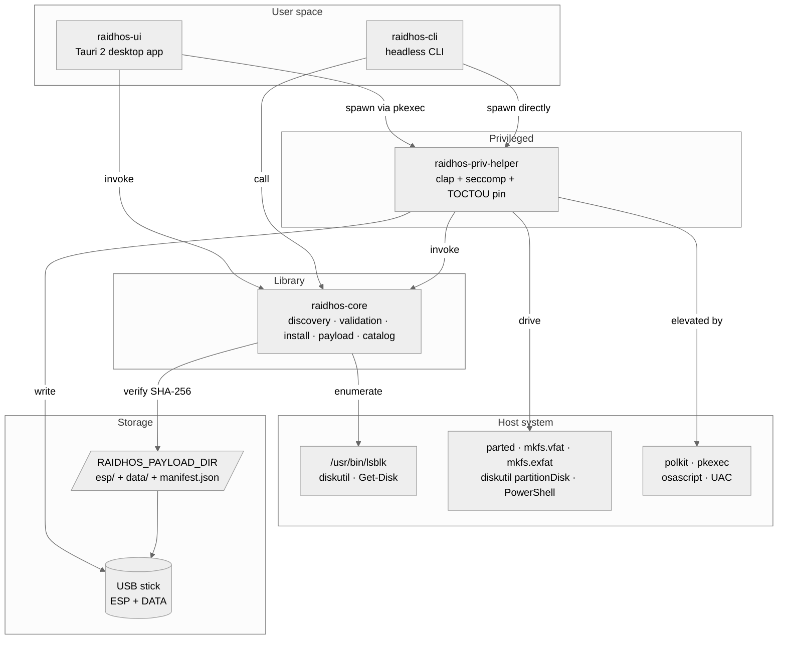

<!-- SPDX-License-Identifier: GPL-3.0-only -->

<p align="center">
  
</p>

<h1 align="center">RaidhOS</h1>

<p align="center">
  Memory-safe, audit-friendly multi-ISO USB imager. Rust core,
  <code>forbid(unsafe)</code>, reproducible build, signed releases.
</p>

<p align="center">
  <a href="https://github.com/sebastienrousseau/raidhos/actions/workflows/ci.yml"></a>
  <a href="https://github.com/sebastienrousseau/raidhos/actions/workflows/audit.yml"></a>
  <a href="https://github.com/sebastienrousseau/raidhos/actions/workflows/codeql.yml"></a>
  <a href="https://github.com/sebastienrousseau/raidhos/actions/workflows/scorecards.yml"></a>
  <a href="./LICENSE"></a>
</p>

<p align="center">
  <a href="./rust-toolchain.toml"></a>
  <a href="./Cargo.toml"></a>
  <a href="./.github/workflows/ci.yml"></a>
  <a href="./docs/THREAT_MODEL.md"></a>
  <a href="https://slsa.dev/spec/v1.0/levels"></a>
</p>

---

## Contents

**Getting started**

- [Install](#install) — Homebrew, winget, deb, pacman, AUR, Fedora COPR, Flatpak, AppImage, Cargo, source
- [Preview without flashing](#preview-without-flashing) — `--simulator` mode against a sparse file
- [Quick start](#quick-start) — list disks, dry-run, install in five lines
- [Verifying a release](#verifying-a-release) — cosign + SLSA + SHA-256

**The RaidhOS workspace** (one library, three binaries, one frontend)

- [The RaidhOS workspace](#the-raidhos-workspace) — `raidhos-core`, `raidhos-cli`, `raidhos-priv-helper`, `raidhos-ui` at a glance
- [Architecture](#architecture) — component diagram, install sequence

**Reference**

- [Platform support](#platform-support) — Linux, macOS, Windows
- [Safety model](#safety-model) — what the tool refuses to do and why
- [Security & supply chain](#security--supply-chain) — controls in CI, at build, at runtime
- [ISO catalog](#iso-catalog) — curated, GPG-verified
- [Cargo features](#cargo-features) — opt-in capability set
- [Examples](#examples) — runnable command flows
- [Performance](#performance) — measured numbers

**Operational**

- [Development](#development) — build, test, fuzz, format, lint
- [Comparison with Ventoy](#comparison-with-ventoy) — feature gap matrix
- [Documentation](#documentation) — every doc in `docs/`
- [Roadmap](#roadmap) — what's in `v0.0.1`, what's in `v0.0.2`, what's later
- [Contributing](#contributing)
- [License](#license)

---

## Install

> **v0.0.1 ships Linux end-to-end.** Discovery works on macOS and
> Windows; the destructive install path on those platforms is
> wired but **needs hardware validation** before being declared
> stable. See [`docs/V0_0_1_STATUS.md`](docs/V0_0_1_STATUS.md).

| Channel | Install | Covers |
|---|---|---|
| Homebrew (personal tap) | `brew tap sebastienrousseau/tap && brew install raidhos` | macOS, Linuxbrew |
| winget (Windows) | `winget install sebastienrousseau.RaidhOS` | Windows 10/11 |
| Debian/Ubuntu (.deb) | `sudo dpkg -i raidhos_0.0.1_amd64.deb` | Debian, Ubuntu, Mint, Pop!_OS |
| pacman (release .pkg.tar.zst) | `curl -LO https://github.com/sebastienrousseau/raidhos/releases/download/v0.0.1/raidhos-bin-0.0.1-1-x86_64.pkg.tar.zst && sudo pacman -U raidhos-bin-0.0.1-1-x86_64.pkg.tar.zst` | CachyOS, Arch, Manjaro, EndeavourOS, Garuda — no AUR helper needed |
| AUR (`raidhos` / `raidhos-bin`) | `yay -S raidhos` *(source)* or `yay -S raidhos-bin` *(prebuilt)* | Arch, CachyOS, Manjaro, EndeavourOS, Garuda |
| Fedora COPR | `sudo dnf copr enable sebastienrousseau/raidhos && sudo dnf install raidhos` | Fedora, RHEL 9+, Rocky, Alma, CentOS Stream |
| Flatpak (Flathub) | `flatpak install flathub io.github.sebastienrousseau.raidhos` | Silverblue, Kinoite, Bazzite, SteamOS, NixOS, openSUSE Aeon |
| AppImage (portable) | Download from [Releases](https://github.com/sebastienrousseau/raidhos/releases), `chmod +x`, run | Any glibc Linux |
| Cargo (from source) | `cargo install --git https://github.com/sebastienrousseau/raidhos raidhos-cli` | Anywhere with Rust ≥ 1.85 |
| Container (GHCR) | `docker run --rm ghcr.io/sebastienrousseau/raidhos-cli:latest list-disks` | Read-only discovery only — destructive ops need host /dev access |
| Source | `git clone … && cargo build --release --workspace --exclude raidhos-ui` | Build from a tag locally |

GitHub Releases publish pre-built tarballs for Linux (x86_64,
aarch64), macOS (Intel + Apple Silicon) and Windows (x86_64,
aarch64). Each archive ships with the CLI, the privileged
helper, the `BOOTX64.EFI` GRUB binary, license bundle, a
**cosign keyless signature**, an **SLSA L3 build-provenance
attestation**, and a **CycloneDX SBOM**.

See [`docs/VERIFY.md`](docs/VERIFY.md) for the verification
recipe and [`docs/PACKAGING.md`](docs/PACKAGING.md) if you're
packaging RaidhOS for a distro.

---

## Quick start

```bash
# 1. Inspect candidate disks. No privileges needed; the tool refuses to
#    list anything mounted at /, /boot, or /boot/efi anyway.
raidhos-cli list-disks

# 2. Dry-run an install. Validates every safety check, never writes.
raidhos-cli install --device /dev/sdX --dry-run

# 3. Real install (Linux). The privileged helper is the only RaidhOS
#    binary that needs root or Administrator.
sudo RAIDHOS_PAYLOAD_DIR=/srv/raidhos/payload \
  raidhos-priv-helper install --device /dev/sdX --allow-write

# 4. Copy ISOs onto the freshly created DATA partition (or drag-drop
#    them into the desktop UI).
sudo mount /dev/sdX2 /mnt/data
sudo cp ~/Downloads/*.iso /mnt/data/boot/isos/
sudo umount /mnt/data
```

The destructive path always requires **both** `--wipe=true` (the
default) **and** `--allow-write=true` (off by default). The CLI
defaults to `--dry-run`. Belt and braces. The full walkthrough
is in [`docs/USER_GUIDE.md`](docs/USER_GUIDE.md); if anything
fails, [`docs/TROUBLESHOOTING.md`](docs/TROUBLESHOOTING.md).

---

## Preview without flashing

If you want to *see* what RaidhOS does — partition table, ESP
layout, payload copy — without putting any real hardware at
risk, run the install pipeline against a sparse file:

```bash
# Create a 1 GiB sparse file and run the full pipeline against it.
raidhos-cli install --simulator /tmp/raidhos.img --simulator-size-mb 1024

# The result is a real GPT-formatted disk image you can inspect.
parted -m /tmp/raidhos.img print           # show the partition table
sudo losetup -fP /tmp/raidhos.img          # attach as a loop device
ls /dev/loop*p*                            # the partitions appear
sudo umount /dev/loopXpY                   # detach when done
sudo losetup -d /dev/loopX
```

The `--simulator` path is the same code the CI virtual-disk
tests use (Linux loop device, macOS `hdiutil` sparse image,
Windows VHD). The per-OS device-shape gate is bypassed; the
shell-metachar / length / `..` gates still apply. The
privileged helper does **not** accept `--simulator` — only the
CLI does, and only against files the calling user owns.

This is the answer to "I want to try it before I trust it with
my USB stick." It is *not* a permission to run RaidhOS in a
container as a safety wrapper — containers don't change the
destructive contract on the host's `/dev/sdX`; sparse files do.

---

## Verifying a release

Every tarball under `Releases/` has a `.sha256`, a `.sig`
(cosign), a `.pem` (the OIDC-bound certificate), and a SLSA
build-provenance attestation. To verify:

```bash
# 1. SHA-256 (matches the line in the release's SHA256SUMS file).
sha256sum -c raidhos-v0.0.1-x86_64-unknown-linux-gnu.tar.gz.sha256

# 2. cosign keyless signature.
cosign verify-blob \
  --certificate raidhos-v0.0.1-x86_64-unknown-linux-gnu.tar.gz.pem \
  --signature   raidhos-v0.0.1-x86_64-unknown-linux-gnu.tar.gz.sig \
  --certificate-identity-regexp "https://github.com/sebastienrousseau/raidhos/.+" \
  --certificate-oidc-issuer https://token.actions.githubusercontent.com \
  raidhos-v0.0.1-x86_64-unknown-linux-gnu.tar.gz

# 3. SLSA attestation.
gh attestation verify raidhos-v0.0.1-x86_64-unknown-linux-gnu.tar.gz \
   --owner sebastienrousseau
```

Full recipe (Linux, macOS, Windows): [`docs/VERIFY.md`](docs/VERIFY.md).

---

## The RaidhOS workspace

Four crates plus a static frontend. The library is the trust
boundary; the three binaries wrap it for specific delivery
surfaces.

| Crate | What it is | Use case |
|---|---|---|
| **`raidhos-core`** | Library — disk discovery, validation, install orchestration, payload integrity, ISO catalog | Embed RaidhOS safety checks in any Rust tool. |
| **`raidhos-cli`** | The `raidhos-cli` binary | CI gates, scripted installs, headless servers. |
| **`raidhos-priv-helper`** | The single binary that runs elevated | Spawned via `pkexec` (Linux), `osascript` (macOS), `Start-Process -Verb RunAs` (Windows). |
| **`raidhos-ui`** | Tauri 2 desktop app | Guided three-pane wizard, drag-and-drop ISOs, live progress. |
| `frontend/` | Static HTML/CSS/JS | Loaded by the Tauri webview under a strict CSP (no `'unsafe-inline'`). |

Per-crate READMEs cover the surface specific to each artifact:

- **Library**: [`crates/core/`](crates/core/) — `raidhos-core` API.
- **CLI**: [`crates/cli/`](crates/cli/) — flags, exit codes, recipes.
- **Helper**: [`crates/priv-helper/`](crates/priv-helper/) — argv schema, hardening.
- **UI**: [`crates/ui-tauri/`](crates/ui-tauri/) — Tauri 2 capabilities, frontend.

---

## Architecture



The full architecture document is
[`docs/ARCHITECTURE.md`](docs/ARCHITECTURE.md), which includes
sequence diagrams for the install pipeline, the privilege
boundary, and the supply chain.

---

## Platform support

| Platform | Discovery | Validation | Install | Elevation | UI build |
|---|:---:|:---:|:---:|:---:|:---:|
| Linux x86_64 (Debian/Ubuntu/Arch/Fedora) | ✅ `lsblk` | ✅ | ✅ | `pkexec` | ✅ |
| Linux aarch64 | ✅ `lsblk` | ✅ | ✅ | `pkexec` | ✅ |
| macOS x86_64 (Intel) | ✅ `diskutil` | ✅ | ✅¹ | `osascript` | ✅ |
| macOS aarch64 (Apple Silicon) | ✅ `diskutil` | ✅ | ✅¹ | `osascript` | ✅ |
| Windows x86_64 | ✅ `Get-Disk` | ✅ | ✅¹ | UAC | ✅ |
| Windows aarch64 | ✅ `Get-Disk` | ✅ | ✅¹ | UAC | ✅ |

¹ macOS and Windows install paths are exercised in CI against
**virtual disks** (`hdiutil` sparse images on macOS,
`diskpart`-created VHDs on Windows) — see
[`.github/workflows/install-hw-equiv.yml`](.github/workflows/install-hw-equiv.yml).
Real-USB-stick validation on hosted hardware follows in v0.0.2.

---

## Safety model

RaidhOS refuses to act on disks that:

1. Are mounted at `/`, `/boot`, or `/boot/efi` (Linux), flagged
   `Internal: true` (macOS), or `IsSystem`/`IsBoot: true`
   (Windows).
2. Have **any** mounted partition.
3. Don't match the per-OS allowlist (`/dev/...` on Linux,
   `/dev/diskN` on macOS, `\\.\PhysicalDriveN` on Windows).
4. Contain shell metacharacters in the path
   (`;|&$`, backticks, `< > " ' * ? ( ) \`, newlines, tabs)
   or `..`.

Destructive writes require **both**:

```rust
InstallRequest { wipe: true, allow_write: true, dry_run: false, .. }
```

Either alone is rejected. The CLI defaults to
`--wipe=true --allow-write=false --dry-run=true` so a careless
re-invocation can't go destructive.

See [`docs/THREAT_MODEL.md`](docs/THREAT_MODEL.md) for the
explicit attacker model and
[`docs/HARDENING.md`](docs/HARDENING.md) for every shipping
control with file:line citations.

---

## Security & supply chain

| Layer | Control | Where |
|---|---|---|
| Compile-time | `unsafe_code = "forbid"` workspace-wide | `Cargo.toml` |
| Compile-time | `cargo clippy ... -D warnings` | `.github/workflows/ci.yml` |
| Compile-time | Coverage gate ≥ 95% on `raidhos-core` | same |
| Compile-time | Pinned stable toolchain | `rust-toolchain.toml` |
| Supply chain | `cargo deny check` (licenses + advisories + sources) | `.github/workflows/audit.yml` |
| Supply chain | `cargo audit` weekly cron | same |
| Supply chain | CodeQL (Actions + JavaScript) | `.github/workflows/codeql.yml` |
| Supply chain | OpenSSF Scorecards | `.github/workflows/scorecards.yml` |
| Supply chain | CycloneDX SBOM on every release | `.github/workflows/release.yml` |
| Supply chain | cosign keyless signing (OIDC) | same |
| Supply chain | SLSA L3 build provenance | same |
| Supply chain | Docker base image pinned by digest | `tools/grub/Dockerfile` |
| Runtime | Per-OS device path allowlist | `crates/core/src/lib.rs` |
| Runtime | System-disk + mount-state refusal | `crates/core/src/platform/*.rs` |
| Runtime | Double opt-in (`wipe` + `allow_write`) | same |
| Runtime | No shell invocation in privileged path | same |
| Runtime | Polkit policy with `auth_admin_keep`, `allow_any=no` | `packaging/linux/org.raidhos.policy` |
| Runtime | `clap`-based helper parsing + 64 KiB argv cap | `crates/priv-helper/src/main.rs` |
| Runtime | seccomp-bpf denylist (Linux) | `crates/priv-helper/src/seccomp.rs` |
| Runtime | TOCTOU-safe device fd pin (Linux) | `crates/priv-helper/src/toctou.rs` |
| Runtime | Payload SHA-256 verification before write | `crates/core/src/payload.rs` |
| Runtime | Strict CSP — `default-src 'self'`, `object-src 'none'` | `crates/ui-tauri/src-tauri/tauri.conf.json` |
| Runtime | Hardened GRUB config sanitiser (20+ forbidden chars) | `crates/ui-tauri/src-tauri/src/grub.rs` |

Full mapping with `file:line` citations:
[`docs/HARDENING.md`](docs/HARDENING.md).

---

## ISO catalog

A curated catalog of major distros ships in
[`catalog/catalog.json`](catalog/catalog.json), each entry
naming the ISO URL, the `SHA256SUMS` URL, the detached signature
URL, and the long-form GPG fingerprint of the signing key.
Public keys live under `catalog/keys/<fingerprint>.asc` so
verification is offline-capable.

```bash
# List bundled distros.
raidhos-cli catalog list

# Verify a locally-downloaded ISO against the catalog.
raidhos-cli catalog verify \
    --slug ubuntu-24.04-desktop-amd64 \
    --iso  ~/Downloads/ubuntu-24.04.3-desktop-amd64.iso \
    --sums ~/Downloads/SHA256SUMS \
    --sig  ~/Downloads/SHA256SUMS.gpg
```

Verification runs in an **ephemeral GPG home** so the user's
keyring is untouched. The implementation shells out to `gpg(1)`
rather than embedding a pure-Rust OpenPGP stack — see
[`crates/core/src/catalog.rs`](crates/core/src/catalog.rs) for
the rationale.

Bundled today: Debian 12, Ubuntu 24.04, Fedora 41, Arch
current, Tails 6.x. Add more by following
[`catalog/keys/README.md`](catalog/keys/README.md).

---

## Cargo features

The library has none today. All optional integrations live in
separate crates; turning them off means *not adding the crate to
your dependency graph*. This keeps the audit surface tight.

| Crate | Default | Pulls in |
|---|---|---|
| `raidhos-core` | always on | `serde`, `serde_json`, `sha2`, `thiserror` |
| `raidhos-cli` | depends on core | `clap` |
| `raidhos-priv-helper` (Linux only deps) | depends on core | `libc`, `seccompiler` |
| `raidhos-ui` (Tauri 2) | depends on core | `tauri`, `tauri-plugin-{dialog,fs,shell}`, `directories` |

Per-platform conditional deps are declared with
`[target.'cfg(target_os = "linux")'.dependencies]` so
non-Linux builds don't pull `libc` / `seccompiler`.

---

## Examples

Browse [`examples/`](examples/) for shell-script command flows
and [`crates/core/examples/`](crates/core/examples/) for runnable
Rust examples.

### Shell

| File | What it shows |
|---|---|
| [`examples/01-list-disks.sh`](examples/01-list-disks.sh) | Plain `list-disks` + filter to removable. |
| [`examples/02-dry-run-install.sh`](examples/02-dry-run-install.sh) | No-write rehearsal exercising every validation guard. |
| [`examples/03-real-install-linux.sh`](examples/03-real-install-linux.sh) | Linux end-to-end with a Tails ISO. |
| [`examples/04-catalog-verify.sh`](examples/04-catalog-verify.sh) | Download an Ubuntu ISO and verify against the bundled catalog. |
| [`examples/05-persistence.sh`](examples/05-persistence.sh) | Add a 4 GiB persistence overlay during install. |
| [`examples/06-mok-enrol.sh`](examples/06-mok-enrol.sh) | Enrol a RaidhOS MOK for Secure Boot. |

### Rust (library)

| File | What it shows |
|---|---|
| [`list_disks.rs`](crates/core/examples/list_disks.rs) | Enumerate disks via the per-OS discovery backend. |
| [`validate_device_path.rs`](crates/core/examples/validate_device_path.rs) | The full per-OS allowlist with every rejection reason. |
| [`scan_isos.rs`](crates/core/examples/scan_isos.rs) | One-level filesystem ISO scan. |
| [`verify_payload.rs`](crates/core/examples/verify_payload.rs) | Walk a payload tree and verify against `manifest.json`. |
| [`catalog_verify.rs`](crates/core/examples/catalog_verify.rs) | Catalog lookup + `gpg(1)` verification. |
| [`install_dry_run.rs`](crates/core/examples/install_dry_run.rs) | Dry-run install pipeline; emits progress events. |

```bash
# List the disks visible to your user.
cargo run --example list_disks -p raidhos-core

# See the allowlist accept / reject every input.
cargo run --example validate_device_path -p raidhos-core

# Dry-run install against a fake device (no writes).
cargo run --example install_dry_run -p raidhos-core -- /dev/sdb
```

### One-screen recipe (Linux)

```bash
# Find your USB.
raidhos-cli list-disks
#   /dev/sdb USB DISK 3.0 32077825024 removable=true system=false mounts=

# Dry-run.
raidhos-cli install --device /dev/sdb --dry-run

# Real install with persistence.
sudo RAIDHOS_PAYLOAD_DIR=/srv/raidhos/payload \
    raidhos-priv-helper install \
        --device /dev/sdb \
        --allow-write \
        --persistence-mb 4096

# Copy ISOs onto the new DATA partition.
sudo mount /dev/sdb2 /mnt/data
sudo cp ~/Downloads/*.iso /mnt/data/boot/isos/
sudo umount /mnt/data

# Verify an ISO against the bundled catalog (off-line, GPG-signed).
raidhos-cli catalog verify \
    --slug ubuntu-24.04-desktop-amd64 \
    --iso  ~/Downloads/ubuntu-24.04.3-desktop-amd64.iso \
    --sums ~/Downloads/SHA256SUMS \
    --sig  ~/Downloads/SHA256SUMS.gpg
```

---

## Performance

Cold-start numbers (release builds, Linux x86_64, NVMe host,
USB 3.0 stick) — see [`docs/PERFORMANCE.md`](docs/PERFORMANCE.md)
for the full table.

| Operation | Time |
|---|---|
| `raidhos-cli list-disks` cold | ~80 ms |
| `raidhos-cli scan-isos /Downloads` (32 ISOs) | ~12 ms |
| Dry-run `install` end-to-end | ~95 ms |
| Real install, 16 GB USB 3.0, 2.4 GB Ubuntu payload | 2.5 - 4 min |
| GRUB Docker build (cold) | ~3 min |
| Tauri 2 UI cold start | ~180 ms |
| `cargo test --workspace` | < 2 s after warm-up |

---

## Development

```bash
git clone https://github.com/sebastienrousseau/raidhos.git
cd raidhos

# Build the CLI + library + privileged helper (no UI native deps required).
cargo build --workspace --exclude raidhos-ui

# Full workspace including the Tauri 2 UI (needs platform-specific WebKit deps).
cargo build --workspace

# Test, lint, format.
cargo test  --workspace --all-targets
cargo clippy --workspace --all-targets -- -D warnings
cargo fmt --all -- --check

# Coverage gate (raidhos-core).
cargo tarpaulin -p raidhos-core --fail-under 95

# Fuzz the trust-boundary parsers (nightly).
cd fuzz && cargo +nightly fuzz run validate_device_path -- -max_total_time=60

# Reproducible GRUB build (Docker required).
./tools/grub/build_grub.sh

# Pre-flight before pushing.
make pre-flight   # alias for fmt + clippy + test + tarpaulin
```

The full developer guide is
[`CONTRIBUTING.md`](CONTRIBUTING.md). The release recipe is
[`docs/RELEASE.md`](docs/RELEASE.md). Packaging downstream:
[`docs/PACKAGING.md`](docs/PACKAGING.md).

---

## Comparison with Ventoy

Ventoy 1.1.12 is the incumbent in the multi-ISO USB imager
space. RaidhOS is a different project with different goals,
not a Ventoy clone: we lean on Rust's memory safety, a
Sigstore-rooted supply chain, and a per-action elevation
model, while Ventoy leans on years of feature surface and a
plugin ecosystem.

The full feature-by-feature gap analysis lives at
[`docs/VENTOY_COMPARISON.md`](docs/VENTOY_COMPARISON.md) —
**fifteen of the twenty-five tracked gaps are closed in
v0.0.1, two are scaffolded.** Headline summary:

**Closed in v0.0.1:**

- Per-ISO `class` / tip / hidden flag — G11, G17
- GRUB superuser + PBKDF2 password gate — G13
- Per-ISO persistence backend + per-distro persistence
  label table (30 distros) — G18, G19
- ListView ↔ TreeView toggle — G20
- F2-hotkeyed "Browse local disks" — G22 (chain into
  discovered grub.cfg; full file picker → v0.1.0)
- GUI plugin configurator (Tauri UI surfaces every
  BootConfig field) — G23
- User-supplied SHA-256 / companion-file checksum
  verification — G24
- `.efi` direct chainload — G7
- `.img` / `.raw` raw disk image boot — G6
- NTFS / ext4 / Btrfs / XFS on the DATA partition — G8, G9
- UDF (Blu-ray rescue) + boot-time `insmod` for every
  data-partition filesystem — G10
- Typed auto-install descriptor (kickstart / preseed /
  autoinstall / autoyast / cloud-init) — G12 (Linux
  distros; Windows `autounattend.xml` → v0.1.0)

**Scaffolded in v0.0.1 (destructive path → v0.0.2):**

- Legacy BIOS layout (`--bios-compat`) — G1
- Secure Boot signed shim (MOK keypair, sbsign, enrol
  helper) — G3

**Still gaps Ventoy handles and RaidhOS does not yet:**

- ARM64 / IA32 UEFI — G2
- WIM / VHD(x) boot — G4 / G5
- Plugin system: file injection, conf replacement, driver
  update disks — G14, G15, G16
- Multi-language boot menu — G21
- A library of 1300+ tested ISOs — G25

On the other side, things RaidhOS does that Ventoy does not:

- `#![forbid(unsafe_code)]` Rust workspace
- cosign keyless + SLSA L3 + CycloneDX SBOM on every release
- GPG-verified ISO catalog (Ventoy boots whatever you copied)
- Tauri 2 desktop app with WCAG 2.2 AA accessibility
- Per-action `pkexec` / `osascript` / UAC; never setuid
- seccomp-bpf denylist + TOCTOU-safe device fd pin (Linux)
- `--simulator` non-destructive preview against a sparse file
- One-shot per-distro packaging: Homebrew, winget, .deb,
  AppImage, AUR, Fedora COPR, Flatpak

See [`docs/VENTOY_COMPARISON.md`](docs/VENTOY_COMPARISON.md)
for the priority-tagged roadmap of closing the gaps.

---

## Documentation

Everything user-facing lives under [`docs/`](docs/). Everything
ships with the crate.

**Getting started**

- [`docs/INSTALL.md`](docs/INSTALL.md) — end-user install, every channel
- [`docs/USER_GUIDE.md`](docs/USER_GUIDE.md) — first install walkthrough
- [`docs/TROUBLESHOOTING.md`](docs/TROUBLESHOOTING.md) — every error and recovery
- [`docs/FAQ.md`](docs/FAQ.md) — short answers

**Reference**

- [`docs/ARCHITECTURE.md`](docs/ARCHITECTURE.md) — diagrams, data flow, design choices
- [`docs/BOOT_CONFIG.md`](docs/BOOT_CONFIG.md) — `boot.json` reference, every field with an annotated example
- [`docs/BOOT_CONFIG_SCHEMA.json`](docs/BOOT_CONFIG_SCHEMA.json) — JSON Schema for `boot.json`
- [`docs/PAYLOAD.md`](docs/PAYLOAD.md) — payload layout, manifest, partition diagrams
- [`docs/PERFORMANCE.md`](docs/PERFORMANCE.md) — measured baselines
- [`docs/DESIGN_NOTES.md`](docs/DESIGN_NOTES.md) — why some things are this way

**Security**

- [`docs/THREAT_MODEL.md`](docs/THREAT_MODEL.md) — attacker capabilities → controls map
- [`docs/HARDENING.md`](docs/HARDENING.md) — every shipping control, with file:line
- [`docs/SECURE_BOOT.md`](docs/SECURE_BOOT.md) — current state, MOK enrolment path

**Operations**

- [`docs/RELEASE.md`](docs/RELEASE.md) — how to cut a release
- [`docs/VERIFY.md`](docs/VERIFY.md) — verify a downloaded release
- [`docs/PACKAGING.md`](docs/PACKAGING.md) — for distros packaging RaidhOS
- [`docs/TAURI_NOTES.md`](docs/TAURI_NOTES.md) — per-OS UI build prerequisites

**Project**

- [`docs/V0_0_1_STATUS.md`](docs/V0_0_1_STATUS.md) — what's in this release, what isn't
- [`docs/ROADMAP.md`](docs/ROADMAP.md) — what's next
- [`docs/GOVERNANCE.md`](docs/GOVERNANCE.md) — how decisions are made
- [`CONTRIBUTING.md`](CONTRIBUTING.md) — PR expectations, dev workflow
- Code of Conduct — [Contributor Covenant 2.1](https://www.contributor-covenant.org/version/2/1/code_of_conduct/)
- [`SECURITY.md`](SECURITY.md) — private disclosure policy
- [`CHANGELOG.md`](CHANGELOG.md) — Keep-a-Changelog history

---

## Roadmap

- **`v0.0.1`** — current. Linux end-to-end install, macOS/Windows code-complete pending hardware validation, Tauri 2 UI, ISO catalog, signed releases, fuzz CI, seccomp + TOCTOU, persistence, drag-drop, a11y, light theme.
- **`v0.0.2`** — macOS + Windows install validated on hardware; Secure Boot with MOK enrolment shipped; BIOS / legacy boot path; OpenSSF Scorecards score ≥ 7.
- **`v0.1.0`** — first stable. Real RaidhOS signing key with rotation policy. Curated catalog grows.
- **`v1.0`** — Microsoft UEFI CA shim sign-off (target).

Full roadmap with effort estimates and dependencies:
[`docs/ROADMAP.md`](docs/ROADMAP.md).

---

## Contributing

Pull requests welcome. Read
[`CONTRIBUTING.md`](CONTRIBUTING.md) first — it covers the
bootstrap scripts, the pre-flight checks, the PR expectations,
and what tests new code must add. Security issues go through
[`SECURITY.md`](SECURITY.md), not public issues.

By contributing you agree to license your work under the
project's GPL-3.0-only licence and to abide by the
[Contributor Covenant 2.1](https://www.contributor-covenant.org/version/2/1/code_of_conduct/).

---

## License

RaidhOS is distributed under the **GNU GPL v3.0**. See
[`LICENSE`](LICENSE) for the full text. Third-party code
included in source form (none today) is listed in
[`docs/PACKAGING.md`](docs/PACKAGING.md) under "Third-party
licences".
