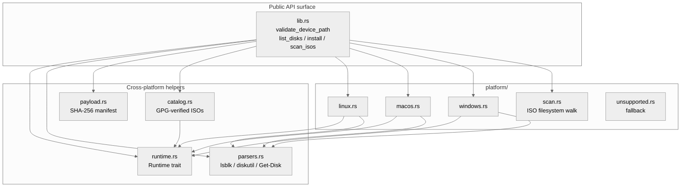

<!-- SPDX-License-Identifier: GPL-3.0-only -->

# `raidhos-core` Architecture

This document describes how the modules of `raidhos-core` fit
together. For the wider workspace see the top-level
[`docs/ARCHITECTURE.md`](../../../docs/ARCHITECTURE.md).

---

## Layered view



Every arrow points downward (no module depends on `lib.rs`).
The `Runtime` trait sits underneath every subprocess call so
each path is unit-testable without touching real binaries.

---

## Trust boundaries

1. **User input → `validate_device_path`**: shell-metachars,
   path traversal, and per-OS shape are gated here.
2. **`InstallRequest` → `validate_install`**: wipe / allow_write
   / mount-check / system-disk-check fire before any byte is
   written.
3. **Payload → `verify_payload`**: SHA-256-walks the tree against
   `manifest.json` (advisory in v0.0.1, blocking from v0.1.0).
4. **Downloaded ISO → `verify_iso`**: GPG verifies SHA256SUMS,
   then SHA-256-checks the ISO bytes.
5. **Subprocess → `Runtime::run_output`**: never goes through a
   shell. Arguments are pre-validated `&[&str]`.

---

## Module catalogue

### `lib.rs`

The public surface. Owns:

- `validate_device_path(&str) -> Result<()>` — the first gate.
- The five thin public entry-points (`list_disks`,
  `list_partitions`, `install`, `scan_isos`, …) that dispatch
  to the matching platform module.
- The `CoreError` enum (variant-stable, `Display`-stable).
- All public types: `DiskInfo`, `PartitionInfo`, `IsoEntry`,
  `InstallRequest`, `ProgressEvent`, `ProgressSink`.

### `runtime.rs`

Defines `trait Runtime`:

```rust
pub trait Runtime {
    fn run(&self, cmd: &str, args: &[&str]) -> Result<()>;
    fn run_output(&self, cmd: &str, args: &[&str]) -> Result<Vec<u8>>;
    fn has_cmd(&self, cmd: &str) -> bool;
    fn env_var(&self, name: &str) -> Option<String>;
    fn path_exists(&self, path: &Path) -> bool;
    fn create_dir_all(&self, path: &Path) -> std::io::Result<()>;
    fn mount_base(&self) -> PathBuf;
}
```

Two implementations:

- `RealRuntime` — `std::process::Command`-backed. Production.
- `MockRuntime` — queue-of-outcomes + recorded invocations. Used
  by every unit test that touches a subprocess.

### `parsers.rs`

Hand-rolled parsers for `lsblk -J`, `diskutil list -plist`, and
`Get-Disk | ConvertTo-Json`. Re-exported `#[doc(hidden)]` via
`__fuzz_api` so cargo-fuzz can call them on any host.

Parser invariants:

- Never panic on malformed input.
- Tolerate field omissions, type mismatches, recursive children.
- Filter `is_system` disks server-side so the install path
  never sees them.

### `payload.rs`

`PayloadManifest` (serde-derived) + `verify_payload`. The
manifest is a flat `BTreeMap<path, sha256-hex>` covering every
file under `esp/` and `data/`. v0.0.1 logs mismatches; v0.1.0
will fail the install.

### `catalog.rs`

ISO catalog (`catalog.json`) + `verify_iso`. Each entry pins the
release's GPG fingerprint; `verify_iso` imports the matching
`.asc` from `catalog/keys/`, verifies the SHA256SUMS signature,
and SHA-256-checks the ISO bytes. All `gpg` invocations go
through `Runtime`.

### `platform/scan.rs`

One-level ISO filesystem walker. Shared by every platform
backend so the scanning behaviour is identical.

### `platform/{linux,macos,windows}.rs`

Per-OS install pipelines. Each exposes:

- `list_disks() -> Result<Vec<DiskInfo>>`
- `list_partitions(device) -> Result<Vec<PartitionInfo>>`
- `install(req, sink) -> Result<()>` (thin wrapper)
- `install_with(req, sink, &dyn Runtime, &[DiskInfo])` (testable
  core, called by `install`)

The `mod.rs` decides which one is active via `#[cfg(target_os =
"…")]`. The other backends still **compile** but are not linked
into the produced binary.

### `platform/unsupported.rs`

Fallback for non-Tier-1 hosts. Every operation returns
`CoreError::UnsupportedPlatform`.

---

## Test surfacing

Coverage targets and tooling:

- **Unit**: 121+ tests under `cargo test -p raidhos-core --lib`.
- **Integration**: `crates/priv-helper/tests/cli.rs` spawns the
  helper binary end-to-end.
- **Property / fuzz**: `fuzz/fuzz_targets/parse_*.rs` exercises
  every parser via cargo-fuzz.
- **Coverage**: `cargo tarpaulin -p raidhos-core --fail-under 65`
  is the current floor; tracking 85% by v0.0.2 and 95% by v0.1.0.

---

## See also

- [`USAGE.md`](USAGE.md) — task-oriented cookbook.
- [`API.md`](API.md) — per-symbol reference.
- [`SECURITY.md`](SECURITY.md) — control inventory with citations.
- [Top-level `docs/THREAT_MODEL.md`](../../../docs/THREAT_MODEL.md).
