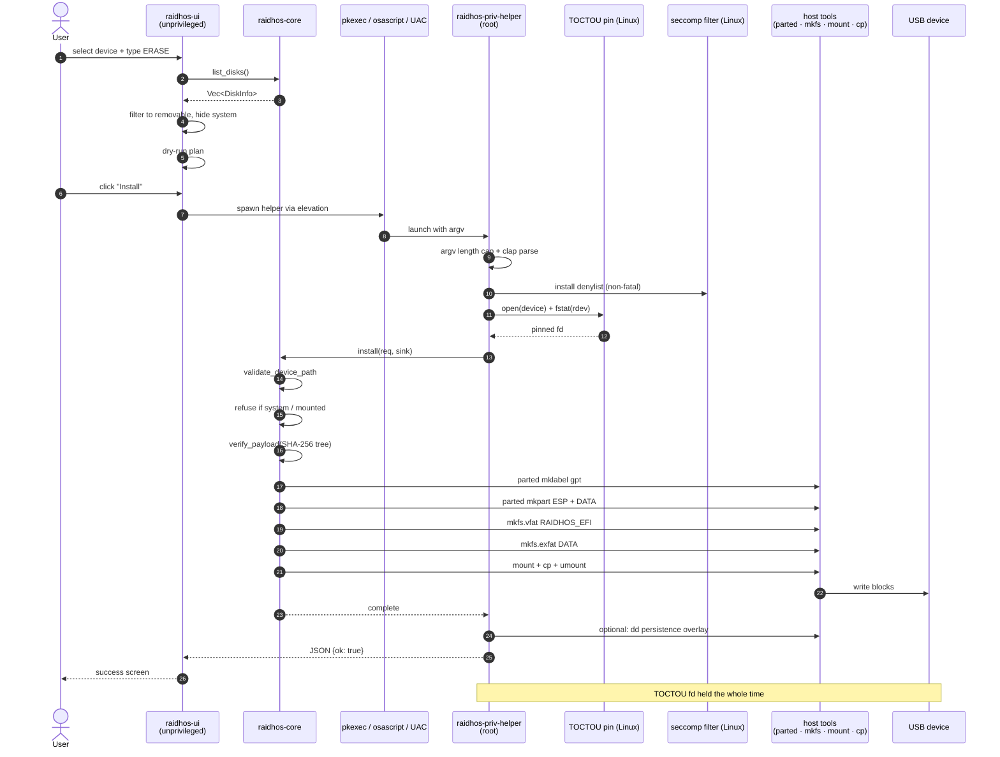
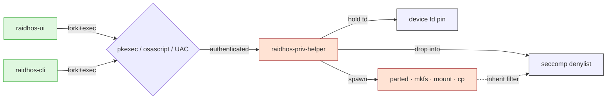
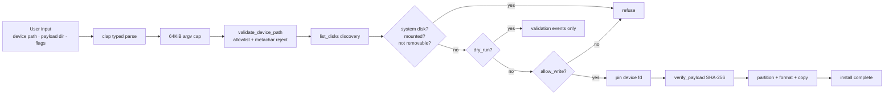
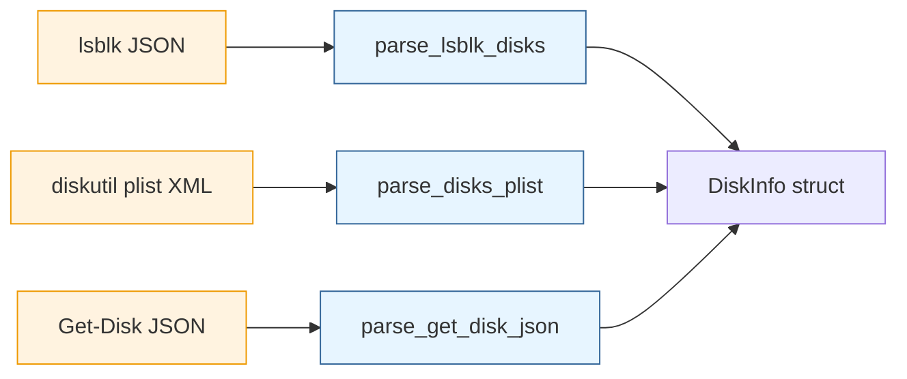
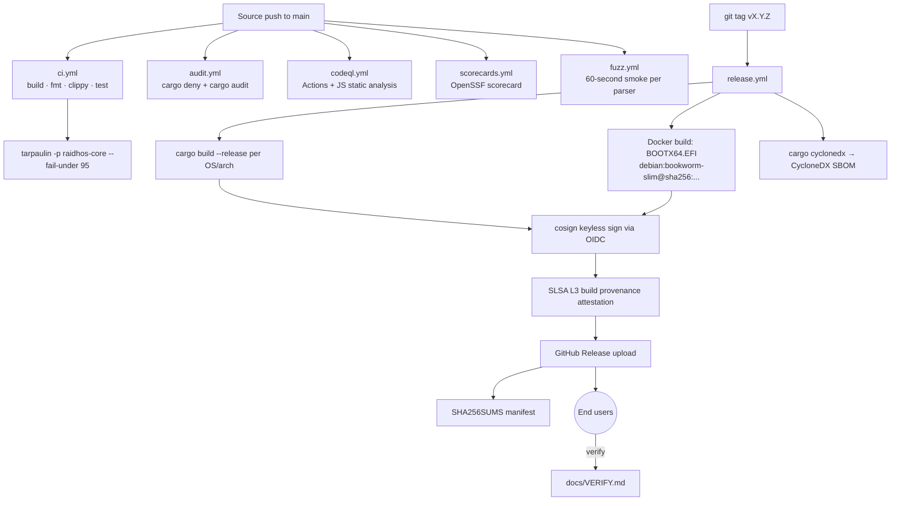

<!-- SPDX-License-Identifier: GPL-3.0-only -->

# Architecture

RaidhOS is **one library, three binaries, one frontend**. The
library is the trust boundary. Every destructive operation
crosses through `raidhos-core` and through `raidhos-priv-helper`
before any byte is written.

---

## Contents

- [High-level component map](#high-level-component-map)
- [Crate-by-crate detail](#crate-by-crate-detail)
- [Install sequence](#install-sequence)
- [Privilege boundary](#privilege-boundary)
- [Data flow](#data-flow)
- [Trust boundaries](#trust-boundaries)
- [Build & supply chain](#build--supply-chain)
- [Why these choices](#why-these-choices)

---

## High-level component map

```mermaid
graph TD
  subgraph UserSpace["User-space, unprivileged"]
    UI["raidhos-ui<br/>Tauri 2 desktop app<br/>(frontend: HTML/CSS/JS)"]
    CLI["raidhos-cli<br/>headless CLI<br/>(clap derive)"]
  end

  subgraph Library["raidhos-core (library)"]
    DISC["Discovery<br/>list_disks · list_partitions"]
    VAL["Validation<br/>validate_device_path"]
    INST["Install orchestrator<br/>per-OS platform modules"]
    PAY["Payload integrity<br/>SHA-256 tree walk"]
    CAT["ISO catalog<br/>GPG verification via gpg(1)"]
    PARSE["Hand-rolled parsers<br/>lsblk · diskutil plist · Get-Disk"]
  end

  subgraph Privileged["Elevated (root / Administrator)"]
    HELPER["raidhos-priv-helper<br/>clap parsing · 64KiB argv cap"]
    TOCTOU["TOCTOU pin<br/>open + fstat + hold fd<br/>(Linux)"]
    SECCOMP["seccomp-bpf denylist<br/>ptrace · bpf · kexec · ...<br/>(Linux)"]
    PERSIST["Persistence overlay<br/>dd + mkfs.ext4 + persistence.conf<br/>(Linux)"]
  end

  subgraph Host["Host system tools"]
    LSBLK["lsblk · diskutil · Get-Disk"]
    PT["parted · diskutil partitionDisk · Clear-Disk"]
    FS["mkfs.vfat · mkfs.exfat · Format-Volume"]
    CP["cp · diskutil · robocopy"]
    ELEV["pkexec / polkit · osascript · UAC"]
  end

  subgraph Storage
    USB[("USB device<br/>GPT + ESP + DATA")]
    PAYLOAD[/"$RAIDHOS_PAYLOAD_DIR<br/>esp/  data/  manifest.json"/]
  end

  UI -->|invoke| DISC
  UI -->|invoke| VAL
  UI -->|invoke| CAT
  UI -->|spawn| HELPER
  CLI -->|call| DISC
  CLI -->|call| VAL
  CLI -->|spawn| HELPER

  DISC --> PARSE
  PARSE --> LSBLK

  HELPER -->|argv parse| VAL
  HELPER -->|hold fd| TOCTOU
  HELPER -->|install filter| SECCOMP
  HELPER --> INST
  HELPER --> PERSIST

  INST --> PAY
  INST --> PT
  INST --> FS
  INST --> CP
  PAY --> PAYLOAD
  PAYLOAD --> USB

  HELPER -->|escalated by| ELEV

  CAT -->|verify via gpg(1)| PAYLOAD
```

Read top-to-bottom: user invokes UI or CLI, which call into the
library for non-destructive work and spawn the privileged helper
for destructive work, which runs as root with seccomp + TOCTOU
guards in place before driving host tools against the USB.

---

## Crate-by-crate detail

### `raidhos-core` (library)

The trust boundary. **No `unsafe`** (forbidden workspace-wide).
Every destructive operation goes through here.

```text
crates/core/src/
├── lib.rs                  Public API, CoreError, validate_device_path
├── parsers.rs              Hand-rolled lsblk / diskutil / Get-Disk parsers
│                           Exposed via __fuzz_api for cargo-fuzz
├── payload.rs              PayloadManifest + verify_payload (SHA-256 tree)
├── catalog.rs              ISO catalog + verify_iso (gpg(1) wrapper)
└── platform/
    ├── mod.rs              cfg-based platform dispatch
    ├── scan.rs             Shared ISO filesystem scanner
    ├── linux.rs            parted / mkfs.vfat / mkfs.exfat / mount / cp
    ├── macos.rs            diskutil partitionDisk / rename / mount / cp / bless
    ├── windows.rs          Clear-Disk / New-Partition / Format-Volume / robocopy
    └── unsupported.rs      CoreError::UnsupportedPlatform for everything else
```

Public surface is intentionally small:

```rust
pub fn list_disks() -> Result<Vec<DiskInfo>>;
pub fn list_partitions(device: String) -> Result<Vec<PartitionInfo>>;
pub fn install(req: InstallRequest, sink: &dyn ProgressSink) -> Result<()>;
pub fn scan_isos(dirs: Vec<String>) -> Result<Vec<IsoEntry>>;
pub fn validate_device_path(device: &str) -> Result<()>;
pub fn verify_payload(payload_dir: &Path) -> Result<(), ManifestError>;
pub fn load_catalog() -> Result<Vec<CatalogEntry>>;
pub fn verify_iso(entry: &CatalogEntry, iso: &Path, sums: &Path,
                  sig: &Path, key_dir: &Path) -> Result<VerifiedIso, CatalogError>;
```

### `raidhos-cli` (binary)

Thin shell over the library. Parses argv with `clap` derive,
prints results to stdout, returns non-zero on validation
failure. **Never** runs elevated — destructive installs delegate
to the helper.

Subcommands: `list-disks`, `scan-isos`, `install`,
`write-config`, `catalog list|verify`.

Man pages and bash/zsh/fish/PowerShell/elvish completions are
emitted at build time by `crates/cli/build.rs` into the build
`OUT_DIR/dist/` — the release workflow picks them up.

### `raidhos-priv-helper` (binary)

The **only** binary intended to run as root. Hardening:

- `clap` typed argv parsing — unknown flags fail loudly.
- 64 KiB hard cap on combined argv byte length.
- (Linux) Seccomp-bpf denylist installed after parse, before
  any privileged work.
- (Linux) TOCTOU defence — opens the device fd, snapshots
  `rdev` via `fstat`, holds the fd for the install lifetime.
- JSON-over-stdout output so callers never parse stderr.
- `--help` / `--version` exit 0 cleanly, not wrapped in a JSON
  error.

### `raidhos-ui` (binary, Tauri 2)

Desktop app. Static HTML/CSS/JS frontend served by Tauri 2
under a **strict CSP** (`default-src 'self'`, no
`'unsafe-inline'` for either scripts or styles,
`object-src 'none'`).

Capabilities declared explicitly in
`crates/ui-tauri/src-tauri/capabilities/default.json`. Plugins:
`tauri-plugin-{dialog,fs,shell}`.

Progress is push-based — the install pipeline emits
`raidhos://progress` events; the frontend subscribes via the
event bus. No `Mutex<Vec<…>>` polling.

### `frontend/` (Tauri webview content)

Vanilla HTML/CSS/JS. No bundler, no npm. Loaded under the
strict CSP, which means no `<style>` blocks and no inline
`<script>` — everything is in `styles.css` and `app.js`. ARIA
labels throughout, `prefers-color-scheme` light theme,
`prefers-reduced-motion` honoured, keyboard-flow tested,
three-step wizard toggleable.

---

## Install sequence

The end-to-end install, from the user's click to a bootable
USB:



The dry-run path is identical until step 5 — the validate stage
returns success without invoking any partition / format / copy
step.

---

## Privilege boundary

There is exactly **one** binary intended to run as root:
`raidhos-priv-helper`. Everything else runs unprivileged. The
UI never elevates itself — it spawns the helper and reads its
JSON stdout.



The polkit policy
([`packaging/linux/org.raidhos.policy`](../packaging/linux/org.raidhos.policy))
sets `allow_any=no`, `allow_inactive=no`,
`allow_active=auth_admin_keep`. A remote SSH session can't
trigger an install; the user must be physically present at an
active session.

---

## Data flow

Every input to the destructive path is validated **before** any
byte is written:



Subprocess output that the library has to trust:



Each parser is a `cargo-fuzz` target via
`raidhos_core::__fuzz_api::*` — see `fuzz/` and
`.github/workflows/fuzz.yml`.

---

## Trust boundaries

| Boundary | What crosses | Defence |
|---|---|---|
| User input → core | device path, payload dir, flags | `validate_device_path`, allowlist, length cap |
| Subprocess output → core | `lsblk`/`diskutil`/`Get-Disk` stdout | typed parsers, fuzz targets, error-on-malformed |
| Webview → host | Tauri IPC `#[tauri::command]` calls | strict CSP, typed args, capabilities allowlist |
| stdin/argv → helper | install args | `clap` typed parse + 64 KiB cap + unknown-flag reject |
| Payload bytes → install | files under `RAIDHOS_PAYLOAD_DIR` | `payload/manifest.json` SHA-256 verification |
| Network → user | release binaries | cosign keyless sig + SLSA L3 + SBOM |
| Host kernel → helper | syscalls reachable from root | seccomp-bpf denylist |
| `/dev/sdX` path → write | re-open between validate and write | TOCTOU fd pin + `fstat` `rdev` check |

---

## Build & supply chain



Reproducibility:

- Rust binaries: `cargo build --release --locked` + pinned
  toolchain in `rust-toolchain.toml` + single-codegen-unit
  release profile.
- GRUB binary: Docker-isolated build from `grub-2.12` source
  in a digest-pinned `debian:bookworm-slim` base image. The
  resulting `BOOTX64.EFI` is byte-identical across runs.

---

## Why these choices

### Why a separate privileged helper instead of `setuid`?

`setuid` confers privileges *to a binary*, regardless of who
launches it. The privileged helper, in contrast, is launched by
an explicit elevation (`pkexec` / `osascript` / UAC) which
prompts the user, runs an audited path, and integrates with the
OS's identity stack. The helper is also seccomp-restricted —
a setuid binary wouldn't be.

### Why JSON over stdout, not a daemon?

A daemon means a long-lived privileged process, an IPC channel,
authentication, and lifecycle management — all extra attack
surface. The helper is fork-exec'd per call, runs to completion,
and exits. The IPC is one-shot stdout, which the OS pipe layer
already gives us. No socket, no daemon manifest, no rendezvous.

### Why hand-rolled parsers?

`lsblk -J`, `diskutil list -plist`, and `Get-Disk | ConvertTo-Json`
each produce a tiny well-known shape. Pulling a plist crate
(macOS) means a runtime dependency just for one parser. Pulling
a full XML library means a wide attack surface. The hand-rolled
parsers are ~150 lines each, easy to audit, and easy to fuzz.

### Why GPL-3.0-only?

RaidhOS depends on `parted` (GPL-3) and `grub` (GPL-3) at
runtime. Distributing combined works under a more permissive
licence would be inconsistent. GPL-3.0-only also matches the
licensing of the Ventoy payload the install pipeline writes.

### Why Tauri 2 over Electron?

Tauri's renderer uses the OS's WebView (WebKit / WebView2 /
WKWebView) rather than bundling Chromium, which keeps the
binary under 10 MiB and the attack surface smaller. Tauri 2's
capabilities model is also a real win over Electron's
`contextIsolation`-based mitigations — capabilities are
declarative, audit-friendly, and enforced by the framework.

### Why a `#[doc(hidden)]` fuzz API?

`cargo-fuzz` targets need to reach the parser functions, but
those parsers are gated by `#[cfg(target_os = "...")]` in the
platform modules. Lifting them into `crate::parsers` and
re-exporting through `crate::__fuzz_api` lets fuzz targets call
them on any host without breaking the platform abstraction. The
`__` prefix and `#[doc(hidden)]` keep the surface out of the
public-facing docs.

---

## See also

- [`docs/THREAT_MODEL.md`](THREAT_MODEL.md) — the attacker model
  this architecture defends against.
- [`docs/HARDENING.md`](HARDENING.md) — every shipping control
  with file:line citations.
- [`docs/DESIGN_NOTES.md`](DESIGN_NOTES.md) — design decisions
  that didn't fit into the threat model.
