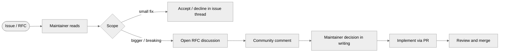

<!-- SPDX-License-Identifier: GPL-3.0-only -->

# Governance

How decisions about RaidhOS get made, who makes them, and how
the project intends to grow beyond a single-maintainer model.

This document is intentionally short. The project is small;
when the project is larger, this document will grow.

---

## Contents

- [Current state](#current-state)
- [Decision-making](#decision-making)
- [Roles](#roles)
- [Security disclosures](#security-disclosures)
- [Conflict of interest](#conflict-of-interest)
- [Adding maintainers](#adding-maintainers)
- [Forks](#forks)
- [Bus factor](#bus-factor)

---

## Current state

RaidhOS is maintained by **Sebastien Rousseau**. There is
exactly one maintainer at v0.0.1. This document explains how
that may evolve and what the rules are in the meantime.

---

## Decision-making

For now, the maintainer makes calls. The process is:

**RFC discussions** are issues prefixed `RFC:` left open for
at least 7 days for community comment before the maintainer
records a decision. Decisions are written into the issue
thread, not just into commit messages.

---

## Roles

| Role | What they can do | Who |
|---|---|---|
| Maintainer | Final say on direction, scope, releases. Hold the signing keys. | Sebastien Rousseau |
| Contributor | Open PRs, file issues, take part in RFCs. | Anyone |
| Security responder | Read disclosures, drive fixes, file CVEs. | Maintainer + invited reviewers |
| Channel maintainer | Maintain a downstream package (Homebrew tap, AUR, deb…) | Distros / community |

We do not have an external steering committee yet.

---

## Security disclosures

See [`SECURITY.md`](../SECURITY.md). The short version:

- Private channel only — email or GitHub's private vulnerability
  reporting.
- 7-day ack, 30-day fix SLA (best effort).
- Public CVE once a fix is shipped.

Embargo: standard 90 days, negotiable downward for critical
issues with active exploitation.

---

## Conflict of interest

The maintainer commits to disclose any commercial relationship
with a packager, mirror, or downstream that could colour a
governance decision. There are no such relationships today.

If a contributor's employer has a stake in a decision, please
disclose in the issue / PR thread.

---

## Adding maintainers

A second maintainer will be added when the project reaches one
of:

- 12 months of weekly releases.
- 3 backports of security-critical fixes.
- An external request from a major downstream (a distro
  packager committing to long-term maintenance, say).

Selection criteria, in priority order:

1. **Trust** — demonstrated good judgement under pressure (PR
   reviews where they disagreed with the maintainer and were
   right).
2. **Domain familiarity** — they've shipped non-trivial PRs in
   the install pipeline, the helper, or the catalog.
3. **Availability** — they have time, and say so.

Adding a maintainer is an RFC that the existing maintainer
proposes; the new maintainer is invited to comment but does
not vote on their own addition.

---

## Forks

GPL-3.0-only encourages forks. We expect them. Two requests:

1. Please **rename** the fork so users don't confuse it with
   upstream. "RaidhOS" is the upstream name; "RaidhOS-foo" is
   reasonable; "RaidhOS Plus" implies endorsement and isn't.
2. If the fork accepts security reports, please publicly
   document a disclosure process equivalent to ours. Critical
   issues affect users regardless of channel.

We will not chase forks for branding; we will ask politely if
a user-facing confusion emerges.

---

## Bus factor

Bus factor is **1** today. We acknowledge this.

Mitigations:

- All maintainer credentials (signing keys, GitHub
  organisation owner, OIDC subject) are documented in a
  sealed disaster-recovery package the maintainer's next-of-kin
  can hand to a designated successor.
- The cosign keyless signing model means there's no
  long-lived private key to lose — Sigstore issues a fresh
  cert per release.
- All releases are reproducible from source, so a successor
  rebuilding from scratch can re-sign with a new identity
  without continuity issues (users will need to re-pin the
  cert-identity regex).
- The Sigstore Rekor transparency log preserves all prior
  signatures even if the GitHub org is lost.

If the maintainer becomes unreachable for >90 days and there
is no second maintainer, the disaster-recovery process is to:

1. Designate a successor via the existing community channels
   (largest contributors first).
2. Have the successor publicly fork, announce, and continue
   under a new name or claim the upstream name with the
   maintainer's explicit transfer (or after the 90-day
   abandonment notice).
3. Re-pin cert-identity in user-facing verify recipes.

This is documented here so the path is clear before it's
needed.
