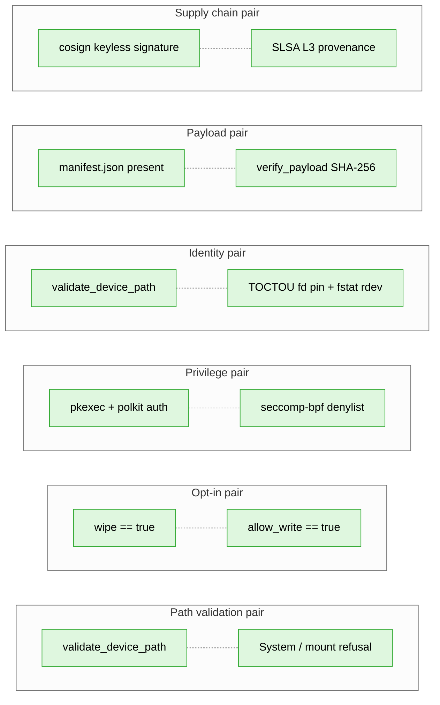
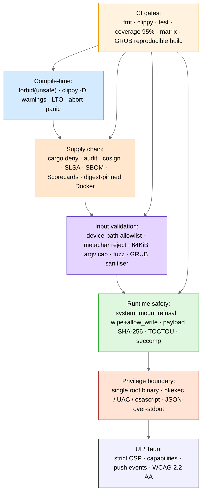

<!-- SPDX-License-Identifier: GPL-3.0-only -->

# Hardening summary

Every shipping security control, grouped by layer, with file
citations so reviewers can verify each in seconds. Pair with
[`THREAT_MODEL.md`](THREAT_MODEL.md) (which attacker each
control addresses).

---

## Contents

- [Compile-time controls](#compile-time-controls)
- [Supply-chain controls](#supply-chain-controls)
- [Input validation](#input-validation)
- [Runtime safety](#runtime-safety)
- [Privilege boundary](#privilege-boundary)
- [Tauri / UI controls](#tauri--ui-controls)
- [CI gates](#ci-gates)
- [Defence-in-depth pairings](#defence-in-depth-pairings)
- [Layered view](#layered-view)
- [What is *not* yet a control](#what-is-not-yet-a-control)

---

## Compile-time controls

| Control | Citation |
|---|---|
| Workspace-wide `unsafe_code = "forbid"` | [`Cargo.toml`](../Cargo.toml) (`[workspace.lints.rust]`) |
| `cargo clippy ... -D warnings` in CI | [`.github/workflows/ci.yml`](../.github/workflows/ci.yml) |
| 95% coverage gate on `raidhos-core` | [`.github/workflows/ci.yml`](../.github/workflows/ci.yml) (`cargo tarpaulin --fail-under 95`) |
| Pinned stable toolchain | [`rust-toolchain.toml`](../rust-toolchain.toml) |
| Resolver v2 (strict feature unification) | [`Cargo.toml`](../Cargo.toml) (`resolver = "2"`) |
| Release profile: thin LTO + strip + abort-on-panic + single codegen unit | [`Cargo.toml`](../Cargo.toml) (`[profile.release]`) |
| `#![warn(missing_docs)]` on `raidhos-core` public API | [`crates/core/src/lib.rs`](../crates/core/src/lib.rs) |

---

## Supply-chain controls

| Control | Citation |
|---|---|
| Advisory database checked | [`deny.toml`](../deny.toml) (`[advisories]`) |
| License allowlist (12 permissive) | [`deny.toml`](../deny.toml) (`[licenses]`) |
| Unknown registry / git source denied | [`deny.toml`](../deny.toml) (`[sources]`) |
| Yanked-crate warnings | [`deny.toml`](../deny.toml) (`yanked = "warn"`) |
| `Cargo.lock` committed (apps) | repo root |
| CycloneDX SBOM on every release | [`.github/workflows/release.yml`](../.github/workflows/release.yml) (`sbom` job) |
| cosign keyless signatures on release artefacts | [`.github/workflows/release.yml`](../.github/workflows/release.yml) (`build` + `grub` jobs) |
| SLSA L3 build-provenance attestation | [`.github/workflows/release.yml`](../.github/workflows/release.yml) (`attest-build-provenance@v1`) |
| Cargo audit + cargo deny scheduled weekly | [`.github/workflows/audit.yml`](../.github/workflows/audit.yml) |
| CodeQL static analysis | [`.github/workflows/codeql.yml`](../.github/workflows/codeql.yml) |
| OpenSSF Scorecards weekly + on push to `main` | [`.github/workflows/scorecards.yml`](../.github/workflows/scorecards.yml) |
| Docker base image pinned by digest | [`tools/grub/Dockerfile`](../tools/grub/Dockerfile) |
| Pinned GitHub Actions by major version | every workflow under `.github/workflows/` |

---

## Input validation

| Control | Citation |
|---|---|
| Device-path allowlist (per OS) | [`crates/core/src/lib.rs`](../crates/core/src/lib.rs) (`validate_device_path`) |
| Shell-metacharacter rejection | [`crates/core/src/lib.rs`](../crates/core/src/lib.rs) (constant `FORBIDDEN`) |
| Path-traversal (`..`) rejection | same |
| Length cap (256 bytes) on device path | same |
| Length cap (64 KiB) on combined helper argv | [`crates/priv-helper/src/main.rs`](../crates/priv-helper/src/main.rs) (`enforce_argv_budget`) |
| Typed argv parsing in helper (`clap` derive) with unknown-flag rejection | [`crates/priv-helper/src/main.rs`](../crates/priv-helper/src/main.rs) |
| Hand-rolled `diskutil` plist parser (no plist dep) | [`crates/core/src/parsers.rs`](../crates/core/src/parsers.rs) (`parse_disks_plist`) |
| `serde`-based `lsblk` JSON parser | [`crates/core/src/parsers.rs`](../crates/core/src/parsers.rs) (`parse_lsblk_disks`) |
| `serde_json::Value` walk for `Get-Disk` output | [`crates/core/src/parsers.rs`](../crates/core/src/parsers.rs) (`parse_get_disk_json`) |
| Fuzz targets over every parser | [`fuzz/fuzz_targets/`](../fuzz/fuzz_targets/) |
| GRUB-config sanitiser rejects 20+ metacharacters + all C0 control bytes | [`crates/ui-tauri/src-tauri/src/grub.rs`](../crates/ui-tauri/src-tauri/src/grub.rs) (`sanitize`) |

---

## Runtime safety

| Control | Citation |
|---|---|
| Refuse mounted partitions | [`crates/core/src/platform/linux.rs`](../crates/core/src/platform/linux.rs) (`validate_install`) |
| Refuse disks mounted at `/`, `/boot`, `/boot/efi` (Linux) | [`crates/core/src/platform/linux.rs`](../crates/core/src/platform/linux.rs) (`is_system` derivation) |
| Refuse disks flagged internal (macOS) | [`crates/core/src/parsers.rs`](../crates/core/src/parsers.rs) (`Internal` plist key) |
| Refuse disks flagged system or boot (Windows) | [`crates/core/src/parsers.rs`](../crates/core/src/parsers.rs) (`IsBoot` / `IsSystem`) |
| Double opt-in: both `wipe` and `allow_write` required | [`crates/core/src/platform/linux.rs`](../crates/core/src/platform/linux.rs) (`install_with_disks`) |
| Default `dry-run = true`, `allow-write = false` (CLI) | [`crates/cli/src/cli.rs`](../crates/cli/src/cli.rs) |
| No shell invocation in privileged path; `std::process::Command` with separated argv | [`crates/core/src/platform/linux.rs`](../crates/core/src/platform/linux.rs) (`run`) |
| Payload presence check (`esp/`, `data/`) | [`crates/core/src/platform/linux.rs`](../crates/core/src/platform/linux.rs) (`payload_copy`) |
| Payload SHA-256 verification before write (advisory in v0.0.1) | [`crates/core/src/payload.rs`](../crates/core/src/payload.rs) (`verify_payload`) |
| TOCTOU device-fd pin via `OpenOptions` + `fstat` `rdev` (Linux) | [`crates/priv-helper/src/toctou.rs`](../crates/priv-helper/src/toctou.rs) |
| seccomp-bpf denylist (Linux) post-parse, pre-write | [`crates/priv-helper/src/seccomp.rs`](../crates/priv-helper/src/seccomp.rs) |
| Persistence overlay validated as `mkfs.ext4` + `persistence.conf` | [`crates/priv-helper/src/main.rs`](../crates/priv-helper/src/main.rs) (`create_persistence`) |

---

## Privilege boundary

| Control | Citation |
|---|---|
| Single privileged binary | [`crates/priv-helper/`](../crates/priv-helper/) — the only binary intended to run as root |
| pkexec via polkit, `auth_admin_keep` | [`packaging/linux/org.raidhos.policy`](../packaging/linux/org.raidhos.policy) |
| `allow_any = no` (no remote elevation) | same |
| `allow_inactive = no` (must have an active session) | same |
| JSON-over-stdout output (machine-readable, never HTML/shell-injectable) | [`crates/priv-helper/src/main.rs`](../crates/priv-helper/src/main.rs) |
| `--help` and `--version` exit 0 cleanly, not wrapped in JSON error | same |
| macOS elevation: `osascript with administrator privileges` | [`crates/ui-tauri/src-tauri/src/main.rs`](../crates/ui-tauri/src-tauri/src/main.rs) (`install_elevated`) |
| Windows elevation: `Start-Process -Verb RunAs` (UAC) | same |

---

## Tauri / UI controls

| Control | Citation |
|---|---|
| Strict CSP: `default-src 'self'` | [`crates/ui-tauri/src-tauri/tauri.conf.json`](../crates/ui-tauri/src-tauri/tauri.conf.json) |
| No `'unsafe-inline'` for scripts | same |
| No `'unsafe-inline'` for styles | same; styles in [`crates/ui-tauri/frontend/styles.css`](../crates/ui-tauri/frontend/styles.css) |
| `frame-ancestors 'none'` | same |
| `form-action 'none'` | same |
| `object-src 'none'` | same |
| `connect-src 'self' ipc: tauri:` only | same |
| Tauri 2 capabilities declared explicitly per window | [`crates/ui-tauri/src-tauri/capabilities/default.json`](../crates/ui-tauri/src-tauri/capabilities/default.json) |
| Windows-subsystem = "windows" on non-debug Windows builds | [`crates/ui-tauri/src-tauri/src/main.rs`](../crates/ui-tauri/src-tauri/src/main.rs) |
| Push-based progress events (no shared mutable state polled from JS) | same (`PROGRESS_EVENT`, `WindowSink`) |

---

## CI gates

| Control | Citation |
|---|---|
| Build on every PR (Linux, macOS, Windows matrix) | [`.github/workflows/ci.yml`](../.github/workflows/ci.yml) |
| `cargo fmt --check` | same |
| `cargo clippy -D warnings` | same |
| Coverage gate ≥ 95% on core | same |
| Reproducible GRUB build via Docker | [`.github/workflows/ci.yml`](../.github/workflows/ci.yml) (`grub-build`) + [`tools/grub/build_grub.sh`](../tools/grub/build_grub.sh) |
| 60-second fuzz smoke on every push | [`.github/workflows/fuzz.yml`](../.github/workflows/fuzz.yml) |
| cargo-deny + cargo-audit weekly + on PR | [`.github/workflows/audit.yml`](../.github/workflows/audit.yml) |
| CodeQL (Actions + JavaScript) weekly + on push to `main` | [`.github/workflows/codeql.yml`](../.github/workflows/codeql.yml) |
| OpenSSF Scorecards weekly + on push to `main` | [`.github/workflows/scorecards.yml`](../.github/workflows/scorecards.yml) |
| Release workflow only on tag push (`v*`) | [`.github/workflows/release.yml`](../.github/workflows/release.yml) |

---

## Defence-in-depth pairings

The point of *defence in depth* is that any **single** layer can fail
without compromising the asset. Every destructive operation in RaidhOS
clears at least two of the following pairings:

---

## Layered view

Each layer reinforces the others. A compromise of one (say, a
parser bug that bypasses input validation) is still bounded by
the runtime opt-in, the privilege boundary, and the supply
chain.

---

## What is *not* yet a control

These appear in the audit only as **roadmap**; do not list them
in claims. Track them in [`V0_0_1_STATUS.md`](V0_0_1_STATUS.md).

- A populated `payload/manifest.json:checksum` (today: empty
  during dev, so `verify_payload` is advisory).
- A signed `BOOTX64.EFI` accepted under Secure Boot (today: the
  binary is reproducible, cosign-signed, and SLSA-attested, but
  not signed for firmware trust). See
  [`SECURE_BOOT.md`](SECURE_BOOT.md).
- A pure-Rust OpenPGP verifier (today: `verify_iso` shells out
  to `gpg(1)`).
- A trimmed Tauri 2 capabilities set (today: `core:default` is
  intentionally broad while the UI stabilises).
- Sandboxing of macOS/Windows helper equivalents (today: only
  Linux has seccomp + TOCTOU).
