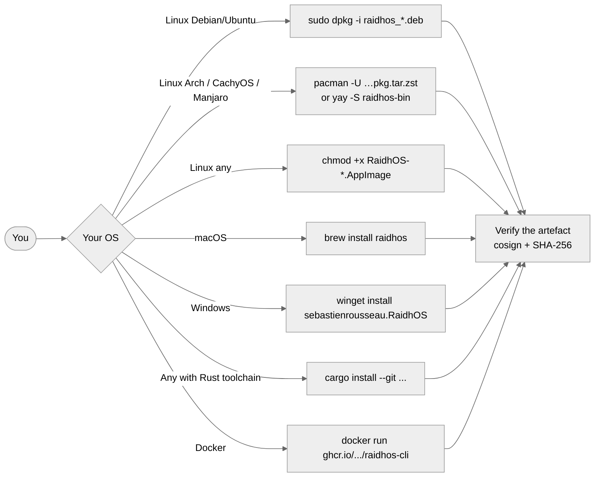

<!-- SPDX-License-Identifier: GPL-3.0-only -->

# Install

End-user install paths. Pick the row that matches your
platform. The post-install steps are the same on every OS —
see [`USER_GUIDE.md`](USER_GUIDE.md) once you have the binary.

## Contents

- [Quick install (per OS)](#quick-install-per-os)
- [Linux](#linux)
- [macOS](#macos)
- [Windows](#windows)
- [Container](#container)
- [From source](#from-source)
- [Verifying what you installed](#verifying-what-you-installed)
- [Uninstall](#uninstall)

---

## Quick install (per OS)



Verification recipe: [`VERIFY.md`](VERIFY.md).

---

## Linux

### Debian / Ubuntu (`.deb`)

```bash
# Replace VERSION + ARCH (amd64 or arm64) appropriately.
VERSION=0.0.1
ARCH=amd64
gh release download v${VERSION} \
    --repo sebastienrousseau/raidhos \
    --pattern "raidhos_${VERSION}_${ARCH}.deb"
sudo dpkg -i raidhos_${VERSION}_${ARCH}.deb
sudo apt-get install -f   # in case of dep gaps
```

The package installs:

- `/usr/bin/raidhos-cli`
- `/usr/lib/raidhos/raidhos-priv-helper`
- `/usr/share/polkit-1/actions/org.raidhos.policy`
- `/usr/share/man/man1/raidhos-cli.1.gz`
- `/usr/share/bash-completion/completions/raidhos-cli`
- (and the zsh / fish completion files in their usual places)

### CachyOS / Arch / Manjaro / EndeavourOS / Garuda

Three install paths, in order of "least new machinery":

```bash
# 1. Straight pacman against the release .pkg.tar.zst.
#    No AUR helper, no makepkg — works on a fresh box.
curl -LO https://github.com/sebastienrousseau/raidhos/releases/download/v${VERSION}/raidhos-bin-${VERSION}-1-x86_64.pkg.tar.zst
# (Recommended) verify the cosign signature before installing:
cosign verify-blob \
    --certificate-identity-regexp 'https://github.com/sebastienrousseau/raidhos/.*' \
    --certificate-oidc-issuer https://token.actions.githubusercontent.com \
    --signature raidhos-${VERSION}-x86_64-unknown-linux-gnu.tar.gz.sig \
    --certificate raidhos-${VERSION}-x86_64-unknown-linux-gnu.tar.gz.pem \
    raidhos-${VERSION}-x86_64-unknown-linux-gnu.tar.gz
sudo pacman -U raidhos-bin-${VERSION}-1-x86_64.pkg.tar.zst
```

```bash
# 2. AUR — same package, fetched and built by your AUR helper.
yay -S raidhos-bin       # pre-built binary, cosign-verified
# or
yay -S raidhos           # build from source under your rustup
```

```bash
# 3. makepkg from the repo (developers / packagers).
git clone https://github.com/sebastienrousseau/raidhos.git
cd raidhos/packaging/arch
makepkg -si              # uses PKGBUILD (source build)
# or
makepkg -si -p PKGBUILD.bin
```

CachyOS users get the same binary as Arch — the package is
`-march=x86-64` (not `-march=x86-64-v3`), so it runs on every
supported CPU. If you want a v3 / v4-optimised local build,
use the AUR `raidhos` source package; rustup will pick up your
`RUSTFLAGS`.

### Fedora / RHEL / Rocky / Alma / CentOS Stream

Two paths, depending on whether you can enable a COPR repo:

```bash
# 1. Straight dnf against the release .rpm.
#    No COPR enable, no Rust toolchain, no rpmbuild.
curl -LO https://github.com/sebastienrousseau/raidhos/releases/download/v${VERSION}/raidhos-bin-${VERSION}-1.x86_64.rpm
# (Recommended) cosign-verify the source tarball before install:
cosign verify-blob \
    --certificate-identity-regexp 'https://github.com/sebastienrousseau/raidhos/.*' \
    --certificate-oidc-issuer https://token.actions.githubusercontent.com \
    --signature raidhos-${VERSION}-x86_64-unknown-linux-gnu.tar.gz.sig \
    --certificate raidhos-${VERSION}-x86_64-unknown-linux-gnu.tar.gz.pem \
    raidhos-${VERSION}-x86_64-unknown-linux-gnu.tar.gz
sudo dnf install ./raidhos-bin-${VERSION}-1.x86_64.rpm
```

```bash
# 2. Fedora COPR — source-built under the COPR runners' rust.
#    Works on Fedora N (current) and -1 only; for RHEL / Rocky /
#    Alma / CentOS Stream use path 1 instead.
sudo dnf copr enable sebastienrousseau/raidhos
sudo dnf install raidhos
```

The binary `.rpm` is `noarch`-free — it ships the same x86_64
or aarch64 binary as every other Linux channel and works on
RHEL 9+ / Rocky 9+ / Alma 9+ / CentOS Stream 9+ as well as
Fedora 41+. There's no `BuildRequires:` so you don't need a
Rust toolchain or pkgconf headers in the install environment.

### AppImage (any modern glibc-based distro)

```bash
chmod +x RaidhOS-${VERSION}-x86_64.AppImage
./RaidhOS-${VERSION}-x86_64.AppImage list-disks
```

AppImages bundle their dependencies — useful when your distro's
WebKit2GTK is older than what Tauri 2 needs.

### Pre-flight (any Linux)

The bootstrap scripts under
[`scripts/`](../scripts/) install only what's missing:

```bash
./scripts/bootstrap-debian.sh    # Debian, Ubuntu
./scripts/bootstrap-arch.sh      # Arch, Manjaro
./scripts/bootstrap-fedora.sh    # Fedora, RHEL-likes
```

---

## macOS

> **v0.0.1 on macOS**: discovery (`list-disks`), validation, and
> dry-run work today. The destructive install path is wired but
> needs hardware validation before being declared stable. Track
> progress in [`V0_0_1_STATUS.md`](V0_0_1_STATUS.md).

### Homebrew (recommended)

```bash
brew tap sebastienrousseau/tap
brew install raidhos
```

The formula installs both `raidhos-cli` and
`raidhos-priv-helper` into `$(brew --prefix)/bin/`, plus the
man page and shell completions.

### Pre-flight (any macOS)

```bash
./scripts/bootstrap-macos.sh
```

Installs `rust` (if missing), `parted` (if you want to build
GRUB locally), `gpg` (for catalog verification), and Tauri's
runtime deps.

---

## Windows

> **v0.0.1 on Windows**: discovery (`list-disks`), validation,
> and dry-run work today. The destructive install path is
> wired but needs hardware validation before being declared
> stable.

### winget (recommended)

```powershell
winget install sebastienrousseau.RaidhOS
```

### Manual `.zip`

```powershell
# Replace VERSION + ARCH (x86_64 or aarch64).
Invoke-WebRequest `
  -Uri "https://github.com/sebastienrousseau/raidhos/releases/download/v0.0.1/raidhos-v0.0.1-x86_64-pc-windows-msvc.zip" `
  -OutFile raidhos.zip
Expand-Archive raidhos.zip -DestinationPath .
.\raidhos-cli.exe list-disks
```

The helper needs UAC — the UI handles that automatically via
`Start-Process -Verb RunAs`. If you're invoking the helper
directly from a non-elevated console, Windows will prompt.

### Pre-flight (any Windows)

```powershell
.\scripts\bootstrap-windows.ps1
```

---

## Container

The `raidhos-cli` binary is available as an OCI image. Useful
for CI gates, scripted scans, and environments where you'd
rather not install anything system-wide.

```bash
# List disks reachable inside the container (limited to those
# the container runtime exposes — usually none of the host's).
docker run --rm \
    ghcr.io/sebastienrousseau/raidhos-cli:0.0.1 list-disks

# Verify a catalog ISO.
docker run --rm \
    -v $(pwd):/work -w /work \
    ghcr.io/sebastienrousseau/raidhos-cli:0.0.1 \
    catalog verify \
        --slug ubuntu-24.04-desktop-amd64 \
        --iso  /work/ubuntu.iso \
        --sums /work/SHA256SUMS \
        --sig  /work/SHA256SUMS.gpg
```

The container does **not** include the privileged helper —
running raw block devices inside a container is intentionally
out of scope. Use the native install for any write operation.

---

## From source

Required toolchain: Rust 1.85+ (the workspace pins to `stable`).
Tauri UI build also needs platform-specific WebKit/WebView2 deps
— the bootstrap scripts install them.

```bash
git clone https://github.com/sebastienrousseau/raidhos.git
cd raidhos

# CLI + helper only — no UI native deps required.
cargo build --release --workspace --exclude raidhos-ui

# Full workspace including Tauri 2 UI.
cargo build --release --workspace
```

Or install directly with Cargo:

```bash
# Will fetch and build the CLI; the helper is built as a
# workspace dependency.
cargo install --git https://github.com/sebastienrousseau/raidhos \
              --locked raidhos-cli
```

---

## Verifying what you installed

Every release artefact ships with a SHA-256, a cosign keyless
signature, a SLSA L3 build-provenance attestation, and is
listed in a `SHA256SUMS` manifest. See [`VERIFY.md`](VERIFY.md)
for the per-platform recipes.

If your binary came from a package manager (Homebrew, winget,
APT, AUR…), the package manager handles signature verification
on your behalf; you don't have to do anything extra.

---

## Uninstall

### Debian / Ubuntu

```bash
sudo apt-get remove raidhos
```

### Arch

```bash
sudo pacman -Rsn raidhos
```

### Homebrew

```bash
brew uninstall raidhos
brew untap sebastienrousseau/tap
```

### winget

```powershell
winget uninstall sebastienrousseau.RaidhOS
```

### AppImage / manual

Just delete the file and (if you want) the per-user config:

```bash
rm -rf ~/.config/raidhos                                  # Linux
rm -rf ~/Library/Application\ Support/raidhos             # macOS
Remove-Item $env:APPDATA\raidhos -Recurse                 # Windows
```

The polkit policy (Linux) lives at
`/usr/share/polkit-1/actions/org.raidhos.policy` and is removed
when the package is uninstalled.
