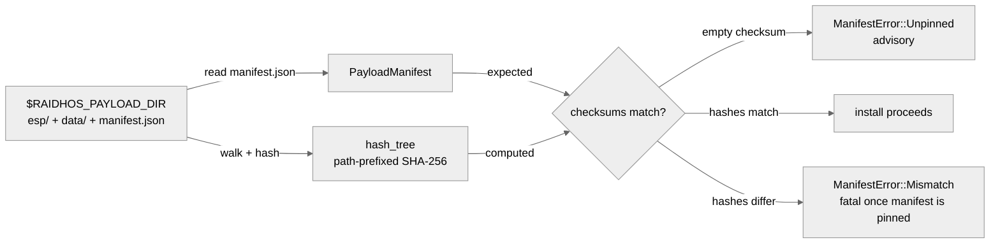
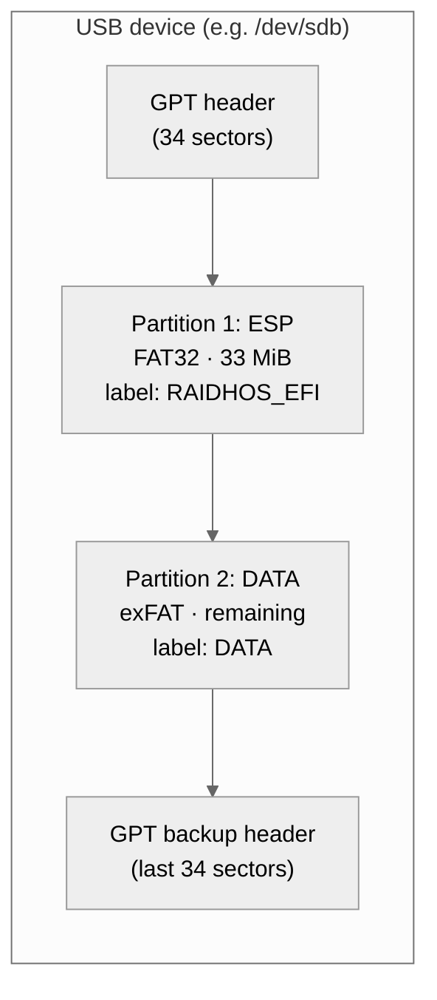

<!-- SPDX-License-Identifier: GPL-3.0-only -->

# Payload layout

The "payload" is the set of bytes that gets copied onto the
target USB during a destructive install. RaidhOS expects it on
the filesystem, pointed at by the `RAIDHOS_PAYLOAD_DIR`
environment variable.

This document describes the layout, the manifest, the
verification flow, and the partition layout that results from a
successful install.

---

## Contents

- [Directory layout](#directory-layout)
- [Manifest](#manifest)
- [Verification](#verification)
- [Partition layout on the target USB](#partition-layout-on-the-target-usb)
- [Copy behaviour](#copy-behaviour)
- [Environment variable](#environment-variable)
- [Errors](#errors)
- [Reproducibility](#reproducibility)

---

## Directory layout

```text
$RAIDHOS_PAYLOAD_DIR/
├── manifest.json          ← required; describes version + checksum
├── esp/                   ← FAT32 ESP root (33 MiB partition)
│   └── EFI/
│       └── BOOT/
│           └── BOOTX64.EFI    ← the GRUB binary produced by tools/grub/
└── data/                  ← exFAT DATA root (rest of the stick)
    ├── boot/
    │   ├── grub/
    │   │   └── grub.cfg   ← generated from BootConfig at install time
    │   └── isos/          ← drop ISOs here (UI also drag-drops them in)
    └── raidhos/
        └── boot.json      ← user-editable boot config
```

`esp/` and `data/` are the only two **required** subdirectories.
Anything else under them is treated as opaque bytes to copy.

---

## Manifest

`manifest.json` is small and stable:

```json
{
  "name": "ventoy-payload",
  "version": "1.1.10",
  "source": "https://www.ventoy.net",
  "checksum": "<lowercase hex SHA-256 of the payload tree>",
  "notes": "Pin exact payload release and verify checksum before install."
}
```

| Field | Required | Purpose |
|---|---|---|
| `name` | yes | Logical name; informational. |
| `version` | yes | Matched against the `payload_version` passed to `install`. |
| `source` | no | Where the payload came from; informational. |
| `checksum` | yes (may be empty during dev) | SHA-256 of the payload tree (see below). Empty means "not yet pinned"; treated as advisory. |
| `notes` | no | Free-form. |

The schema is enforced by `serde::Deserialize` on
[`PayloadManifest`](../crates/core/src/payload.rs) — unknown
fields are accepted silently (deliberate, so future fields
don't break old binaries; revisit if we add anything
security-sensitive).

---

## Verification



Algorithm (one pass, order-stable, in
[`crates/core/src/payload.rs:hash_tree`](../crates/core/src/payload.rs)):

1. Walk every regular file under `$RAIDHOS_PAYLOAD_DIR`
   (recursive). Symlinks and special files are ignored.
2. Sort by relative path so the order is stable across
   filesystems.
3. For each file, feed `<relative-path>\0<file-bytes>\0` into a
   single SHA-256 hasher.
4. Return the lowercase-hex digest.

The path is prefixed so renaming a file changes the hash; a
trailing nul separates files so concatenating two adjacent
files can't equal a single combined file.

Today `checksum` is empty during development, so verification
returns `ManifestError::Unpinned` and the install pipeline
emits a `ProgressEvent` warning. Once the release workflow
pins the checksum, mismatch becomes fatal.

---

## Partition layout on the target USB



| # | Filesystem | Size | Label | Purpose |
|---|---|---|---|---|
| 1 | FAT32 | 33 MiB | `RAIDHOS_EFI` | EFI System Partition; firmware looks here for `\EFI\BOOT\BOOTX64.EFI`. |
| 2 | exFAT | rest of stick | `DATA` | Houses `boot/grub/grub.cfg`, `boot/isos/*.iso`, and (optionally) the persistence overlay. |

Why exFAT for DATA? It handles >4 GiB ISOs (FAT32 can't), it's
broadly compatible across Linux / macOS / Windows for read-only
mounts, and it's well-supported by GRUB's `exfat` module. The
trade-off is a small dependency (`exfatprogs` on Linux) — the
install pipeline checks for `mkfs.exfat` and falls back to
`mkexfatfs` before refusing.

---

## Copy behaviour

| Platform | Tool | Flags |
|---|---|---|
| Linux | `cp -a` | preserves perms / timestamps / symlinks |
| macOS | `cp -R` | recursive copy into the mounted volume |
| Windows | `robocopy` | `/E /NFL /NDL /NJH /NJS`; exit code 0..7 is success |

After the copy:

- The ESP partition is unmounted.
- The DATA partition is unmounted.
- (Optional, Linux only) Persistence overlay is created on
  DATA with `dd` + `mkfs.ext4 -L persistence` + a tiny
  `persistence.conf` of `/ union`.

---

## Environment variable

```bash
export RAIDHOS_PAYLOAD_DIR=/srv/raidhos/payload-1.1.10
sudo -E raidhos-priv-helper install --device /dev/sdX --allow-write
```

Or, equivalently, inline:

```bash
sudo RAIDHOS_PAYLOAD_DIR=/srv/raidhos/payload-1.1.10 \
  raidhos-priv-helper install --device /dev/sdX --allow-write
```

A plain `sudo` strips the variable; either `sudo -E` or the
inline form preserves it.

---

## Errors

| Error string | Cause | Fix |
|---|---|---|
| `RAIDHOS_PAYLOAD_DIR is not set` | env var missing | Export it or pass inline. |
| `RAIDHOS_PAYLOAD_DIR does not exist` | path is wrong | Point it at a real directory. |
| `RAIDHOS_PAYLOAD_DIR must contain esp/ and data/ directories` | layout is wrong | Re-stage the payload following [Directory layout](#directory-layout). |
| Progress event: `Payload integrity warning: payload checksum not pinned in manifest (development-only payload)` | `manifest.json:checksum` is empty | Pin the checksum before release. |
| Progress event: `Payload integrity warning: payload checksum mismatch ...` | the tree differs from the manifest | Re-stage from a known-good source; verify upstream. |

---

## Reproducibility

The payload tree itself is intended to be reproducible across
machines:

- The `manifest.json:checksum` hash is order-stable because
  the walker sorts paths.
- File content is byte-for-byte; metadata (mtime, perms) is
  **not** included in the hash. Two trees that differ only in
  timestamps still hash equal.

This is the trade-off: rsync'ing the payload between machines
preserves the hash even if mtimes drift. If a future release
needs to bind mtimes / perms / xattrs, the hash function will
add them — and the manifest format will gain a version bump.

---

## See also

- [`THREAT_MODEL.md`](THREAT_MODEL.md) — the
  "payload mirror operator" attacker this verification
  addresses.
- [`crates/core/src/payload.rs`](../crates/core/src/payload.rs)
  — the implementation.
- [`docs/BOOT_CONFIG_SCHEMA.json`](BOOT_CONFIG_SCHEMA.json) —
  schema for the `boot.json` that ends up on the DATA
  partition.
