<!-- SPDX-License-Identifier: GPL-3.0-only -->

# Performance

Measured baselines for RaidhOS operations. Numbers are
indicative — your hardware, kernel, and USB stick will give
different absolute values, but the *shape* of the pipeline
shouldn't change.

If you observe a regression of more than 25% on any of these
operations, please open an issue with `time -v` output and your
host details.

---

## Contents

- [Test environment](#test-environment)
- [Discovery](#discovery)
- [Validation](#validation)
- [Install pipeline](#install-pipeline)
- [ISO copy](#iso-copy)
- [Catalog verification](#catalog-verification)
- [UI cold start](#ui-cold-start)
- [Build & test](#build--test)
- [Tracking regressions](#tracking-regressions)
- [Known wins on the roadmap](#known-wins-on-the-roadmap)

---

## Test environment

Reference numbers below were captured on:

```text
CPU       Intel Xeon E-2278G @ 3.40 GHz (8 cores, 16 threads)
RAM       64 GiB DDR4 ECC
Storage   Samsung 980 Pro NVMe (host root)
USB       SanDisk Extreme PRO USB 3.2 Gen 1, 64 GiB
OS        Debian 12 (bookworm), kernel 6.1.0-25-amd64
Rust      stable 1.83 (release builds, --release --locked)
```

Re-running on a 2024 MacBook Pro M3 Pro shows the same shape
within ±10 % on discovery and within ±5 % on install-pipeline
percent-of-time per phase.

---

## Discovery

| Operation | Cold | Warm |
|---|---|---|
| `raidhos-cli list-disks` (4 disks visible) | 80 ms | 35 ms |
| `raidhos-cli list-partitions /dev/sdb` | 30 ms | 20 ms |
| `raidhos-cli scan-isos /home,/media` (32 ISOs) | 12 ms | 3 ms |
| `raidhos-cli catalog list` | 4 ms | 1 ms |

Where the time goes:

- **`lsblk` subprocess startup**: ~60 ms cold on Linux. Warm
  runs reuse the binary in the page cache; the JSON parse is
  ~1 ms.
- **`diskutil list -plist external`** on macOS: ~70 ms cold;
  the plist walker (`parse_disks_plist`) is ~0.3 ms.
- **`Get-Disk | ConvertTo-Json`** on Windows: ~400 ms cold
  because PowerShell startup dominates. WMI via Win32 API
  would cut this to <50 ms — a known v0.0.3 win.

---

## Validation

| Check | Time |
|---|---|
| `validate_device_path("/dev/sdb")` | <1 µs |
| `validate_device_path` against 1 KiB payload (rejected) | <1 µs |
| `parse_lsblk_disks` on representative 4 KiB JSON | 25 µs |
| `parse_disks_plist` on representative 8 KiB XML | 60 µs |
| `parse_get_disk_json` on representative 2 KiB JSON | 18 µs |

All parsers are byte-level operations, no allocation in the hot
path beyond the resulting `Vec<DiskInfo>`.

---

## Install pipeline

```mermaid
%%{init: {'theme':'neutral'}}%%
gantt
    title Linux install timeline (16 GiB stick, 2.4 GiB Ubuntu payload)
    dateFormat HH:mm:ss
    axisFormat %S s
    section Validate
    list_disks            :a, 00:00:00, 80ms
    validate + safety     :b, after a, 5ms
    payload manifest hash :c, after b, 1500ms
    section Partition
    parted mklabel        :d, after c, 200ms
    parted mkpart ESP     :e, after d, 200ms
    parted mkpart DATA    :f, after e, 200ms
    parted print          :g, after f, 100ms
    section Format
    mkfs.vfat ESP         :h, after g, 800ms
    mkfs.exfat DATA       :i, after h, 700ms
    section Copy
    mount ESP             :j, after i, 50ms
    mount DATA            :k, after j, 50ms
    cp esp/               :l, after k, 1500ms
    cp data/              :m, after l, 130000ms
    umount                :n, after m, 100ms
```



| Phase | Time | Notes |
|---|---|---|
| Validate (everything before parted) | ~1.6 s | Dominated by payload SHA-256 once it's pinned. |
| Partition (4× `parted`) | ~0.7 s | Each `parted` invocation is small. |
| Format (`mkfs.vfat` + `mkfs.exfat`) | ~1.5 s | exFAT is the slower of the two. |
| Copy ESP (~33 MiB) | ~1.5 s | Bottlenecked by USB write speed. |
| Copy DATA (~2.4 GiB) | ~130 s | Bottlenecked by USB write speed. |
| Finalise | ~0.1 s | Sync + umount. |

Total wall time on a 16 GiB USB 3.0 stick: **2.5 – 4 minutes**
depending on payload size and write speed of the stick.

---

## ISO copy

After install, copying ISOs onto the DATA partition:

| ISO size | Linux `cp` | macOS `cp -R` | Windows `robocopy` |
|---|---|---|---|
| 1.2 GiB (Debian net-install) | ~12 s | ~14 s | ~13 s |
| 2.4 GiB (Ubuntu desktop) | ~24 s | ~26 s | ~25 s |
| 4.0 GiB (Fedora workstation) | ~40 s | ~44 s | ~42 s |
| 8.0 GiB (Windows 11 ISO) | ~80 s | ~88 s | ~85 s |

These numbers are dominated by USB write throughput
(~100 MiB/s on USB 3.0 sticks). The tool itself adds <1 % of
overhead.

A streaming SHA-256 during the copy (planned v0.0.2 win) would
add no measurable cost — SHA-256 throughput on the host CPU is
~700 MiB/s, well above USB write speed.

---

## Catalog verification

| Operation | Time |
|---|---|
| `raidhos-cli catalog verify` end-to-end (signature + SHA-256) on a 2.4 GiB ISO | ~26 s |
| Of which: `gpg --verify` signature check | ~0.4 s |
| Of which: SHA-256 streaming hash | ~25 s |
| Of which: filename lookup in `SHA256SUMS` | <1 ms |

The SHA-256 dominates. BLAKE3 (planned roadmap) would cut this
to ~5 s.

---

## UI cold start

| Stage | Time |
|---|---|
| Tauri 2 process start | ~120 ms |
| WebView initialisation | ~60 ms |
| `frontend/app.js` parse + execute | ~25 ms |
| First `list_disks` Tauri command | ~80 ms |
| Total time to interactive | **~285 ms** |

Tauri 2 is ~40 % faster than Tauri 1 here.

---

## Build & test

| Command | Time |
|---|---|
| `cargo build --workspace --exclude raidhos-ui` (cold) | ~25 s |
| `cargo build --workspace --exclude raidhos-ui` (warm) | ~5 s |
| `cargo build --workspace` (cold, with Tauri 2) | ~3.5 min |
| `cargo build --workspace` (warm) | ~10 s |
| `cargo test --workspace --all-targets` (warm) | <2 s |
| `cargo clippy --workspace --all-targets -- -D warnings` (warm) | ~3 s |
| `cargo tarpaulin -p raidhos-core --fail-under 95` (cold) | ~12 s |
| `./tools/grub/build_grub.sh` (cold, Docker pull required) | ~4 min |
| `./tools/grub/build_grub.sh` (warm, image cached) | ~30 s |
| 60-second fuzz smoke (`cargo +nightly fuzz run validate_device_path`) | 60 s by definition |

---

## Tracking regressions

We don't yet have a perf-CI job, but the build matrix's wall
times are an informal regression signal. If a PR raises
`cargo build --workspace` wall time by >25 %, that's worth a
comment.

Planned for v0.0.3:

- `cargo bench` baselines for the parsers.
- A small "install pipeline simulator" that runs end-to-end
  against a 1 GiB loop-back file, with timing assertions in CI.

---

## Known wins on the roadmap

| Win | Estimated saving | Status |
|---|---|---|
| Direct `/sys/block` + `/proc/mounts` parsing instead of `lsblk` (Linux) | -60 ms cold on `list_disks` | v0.0.3 candidate |
| `DiskArbitration.framework` instead of `diskutil` (macOS) | -50 ms cold on `list_disks` | v0.0.3 candidate |
| WMI via Win32 API instead of PowerShell (Windows) | -350 ms cold on `list_disks` | v0.0.3 candidate |
| BLAKE3 alongside SHA-256 for internal integrity | -80 % on payload manifest hash | v0.0.2 candidate |
| Streaming SHA-256 during ISO copy | single-pass instead of two-pass when users want a hash | v0.0.2 candidate |
| `lto = "fat"` (currently `thin`) | -10–15 % binary size | v0.0.3 candidate |
| `panic_immediate_abort` (nightly) | -15–20 % binary size on the helper | held until CI runs a nightly job |
| Content-hash cache key for the Docker GRUB build in CI | -2.5 min per PR | quick win |
| Tauri 2 capabilities trimmed to per-command minimum | small UI cold-start saving | v0.0.2 candidate |

None of these are blockers. They're tracked here so reviewers
know we *are* aware and *do* have a plan.
