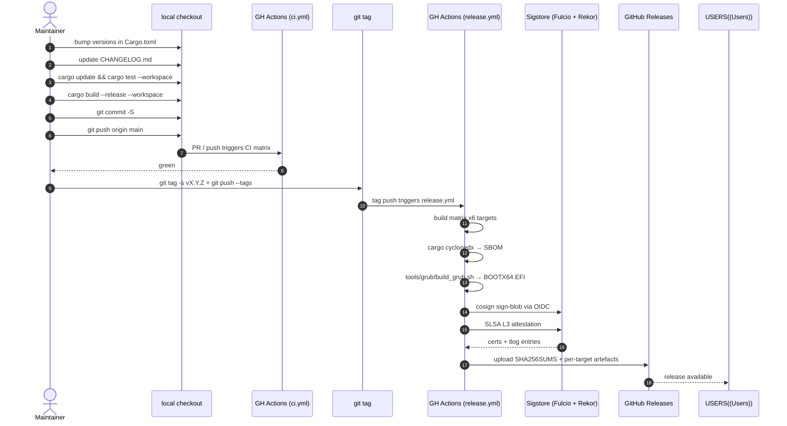

<!-- SPDX-License-Identifier: GPL-3.0-only -->

# Release engineering

How RaidhOS releases are cut. Audience: maintainers and anyone
auditing the release path. Users who just want to **verify** a
release should read [`VERIFY.md`](VERIFY.md).

---

## Contents

- [Release cadence](#release-cadence)
- [Versioning](#versioning)
- [Cutting a release — the runbook](#cutting-a-release--the-runbook)
- [Release pipeline diagram](#release-pipeline-diagram)
- [What each artefact is](#what-each-artefact-is)
- [Hot-fix releases](#hot-fix-releases)
- [Yanking a release](#yanking-a-release)
- [Provenance trail](#provenance-trail)
- [Reproducibility checklist](#reproducibility-checklist)

---

## Release cadence

| Track | Cadence |
|---|---|
| Major (`vX.0.0`) | Annual, or when a backward-incompatible change is unavoidable. |
| Minor (`v0.X.0`) | When a new platform or feature ships. |
| Patch (`v0.0.X`) | As needed — security fixes, bug fixes, doc-only updates with corrections to safety statements. |
| Release candidate (`v0.0.X-rc.N`) | Always before a `v0.0.X` to exercise the workflow end-to-end. |

While the project is `0.x.y`, **everything** is potentially
breaking. We will be conservative about changes to the install
pipeline and helper argv schema, but reserve the right to break
internals.

---

## Versioning

Semantic Versioning 2.0.0. The library's public API surface
(`raidhos-core` exports) is the contract; CLI subcommands and
their argv shapes are part of the contract once the project
reaches `1.0.0`. Until then, CLI argv changes are signposted in
the changelog and announced one release in advance where
possible.

---

## Cutting a release — the runbook



### Pre-flight checklist

```text
- [ ] Local clean working tree (`git status`).
- [ ] CI green on main.
- [ ] All workflows green (ci · audit · codeql · fuzz · scorecards).
- [ ] CHANGELOG.md updated under [Unreleased]; cut a new heading.
- [ ] docs/V0_0_1_STATUS.md (or equivalent for this version) up to date.
- [ ] Cargo.toml workspace.package.version bumped.
- [ ] crates/*/Cargo.toml versions bumped (each package).
- [ ] cargo update with intent (no opportunistic minor bumps in a patch release).
- [ ] cargo test --workspace --all-targets passes.
- [ ] cargo clippy --workspace --all-targets -- -D warnings passes.
- [ ] cargo deny check passes.
- [ ] tools/grub/build_grub.sh produces a byte-identical BOOTX64.EFI to a prior run.
- [ ] docs/VERIFY.md verification recipe still works against a prior release.
- [ ] git tag -s vX.Y.Z -m "vX.Y.Z" (signed, annotated).
```

### Push the tag

```bash
git tag -s v0.0.1 -m "RaidhOS v0.0.1"
git push origin v0.0.1
```

A signed annotated tag is **required** — the release workflow
won't sign artefacts for an unsigned tag in v0.0.2+.

### Watch the workflow

The `release.yml` workflow runs jobs in parallel where possible:

- `build` matrix (x86_64/aarch64 × Linux/macOS/Windows) — each
  builds, archives, hashes, cosigns, and attests.
- `sbom` — `cargo cyclonedx` produces `raidhos.cdx.json`.
- `grub` — Docker-built `BOOTX64.EFI` + cosign + SLSA.
- `publish` — gathers everything, writes `SHA256SUMS`, creates
  the GitHub Release.

Typical wall time: 20–30 minutes.

### Post-release

```text
- [ ] Verify the release as a user would (docs/VERIFY.md recipe).
- [ ] Update Homebrew formula's SHA-256 in packaging/homebrew/raidhos.rb.
- [ ] Update winget manifest in packaging/winget/.
- [ ] Update Debian changelog in packaging/debian/changelog.
- [ ] Announce in CHANGELOG.md (final non-`[Unreleased]` entry).
- [ ] Bump Cargo.toml back to next -dev version.
```

---

## Release pipeline diagram

```mermaid
flowchart TB
  subgraph trigger
    TAG([git tag vX.Y.Z])
  end

  subgraph parallel["release.yml — runs in parallel"]
    direction LR
    BUILD[build matrix<br/>6 targets]
    GRUB[Docker GRUB build<br/>BOOTX64.EFI]
    SBOM[cargo cyclonedx<br/>raidhos.cdx.json]
  end

  TAG --> BUILD
  TAG --> GRUB
  TAG --> SBOM

  BUILD --> SIGN1[cosign sign-blob]
  GRUB  --> SIGN2[cosign sign-blob]

  SIGN1 --> ATTEST1[attest-build-provenance@v1]
  SIGN2 --> ATTEST2[attest-build-provenance@v1]

  ATTEST1 --> COLLECT[publish job<br/>collect artefacts]
  ATTEST2 --> COLLECT
  SBOM    --> COLLECT
  COLLECT --> CHK[generate SHA256SUMS]
  CHK --> REL[create / update<br/>GitHub Release]

  REL --> USERS([end users])
  USERS -.->|VERIFY.md| VFY[cosign verify-blob<br/>+ gh attestation verify<br/>+ sha256sum -c]
```

---

## What each artefact is

For each target (`x86_64-unknown-linux-gnu`,
`aarch64-unknown-linux-gnu`, `x86_64-apple-darwin`,
`aarch64-apple-darwin`, `x86_64-pc-windows-msvc`,
`aarch64-pc-windows-msvc`):

| File | What it is |
|---|---|
| `raidhos-vX.Y.Z-<target>.tar.gz` (`.zip` on Windows) | The artefact: CLI + helper + man page + completions + LICENSE + SECURITY.md + CHANGELOG.md. |
| `…sha256` | SHA-256 of the artefact, in `sha256sum` format. |
| `…sig` | cosign keyless signature. |
| `…pem` | OIDC-bound short-lived certificate cosign produced. |

Plus, per release:

| File | What it is |
|---|---|
| `SHA256SUMS` | One line per file. Pair with `sha256sum -c`. |
| `raidhos.cdx.json` | CycloneDX SBOM. |
| `BOOTX64.EFI` + `.sha256` + `.sig` + `.pem` | Reproducibly built GRUB binary, signed. |

The SLSA L3 build-provenance attestation is *not* a separate
file — it's queryable through `gh attestation verify` (or the
GitHub API) and stored on Sigstore.

---

## Hot-fix releases

A hot-fix bumps the patch version (`0.0.1 → 0.0.2`) and:

1. Cherry-picks the security fix onto the release tag.
2. Re-runs the **same** runbook (including the pre-flight
   checklist).
3. Updates the relevant `docs/` if the fix changes behaviour or
   the threat model.

For SECURITY.md-disclosed issues, the [GitHub Security Advisory](https://github.com/sebastienrousseau/raidhos/security/advisories)
goes live concurrently with the release.

---

## Yanking a release

If a release ships a critical bug:

1. Mark the GitHub Release as a **pre-release** (visual cue).
2. Open a SECURITY advisory citing the affected versions.
3. Cut the next patch (`v0.0.X+1`) per the runbook.
4. Do **not** delete the tag — Sigstore Rekor entries and SLSA
   attestations reference it; deleting breaks downstream
   verification flows.

Cargo crates are *yanked* with `cargo yank --vers X.Y.Z` if /
when the library is published.

---

## Provenance trail

A user holding an artefact can reconstruct:

| Question | Answer source |
|---|---|
| Is this byte-identical to what RaidhOS built? | `SHA256SUMS` + local `sha256sum -c` |
| Was this signed by the project's CI? | `cosign verify-blob` with the project's certificate-identity regex |
| Which commit produced this? | `gh attestation verify` (predicate `subject.digest.sha256` + `subject.name` + `predicate.buildDefinition.externalParameters.workflow.repository`) |
| Is the signature publicly logged? | Rekor inclusion proof is part of the cosign output |
| What dependencies are inside? | `raidhos.cdx.json` SBOM |
| What licences? | SBOM `licenses[]` field per component |

All of these checks are scriptable; we ship them as a single
shell snippet in [`VERIFY.md`](VERIFY.md).

---

## Reproducibility checklist

For each release we assert:

| Claim | How |
|---|---|
| `BOOTX64.EFI` is byte-identical across re-runs | Docker base image digest-pinned; `grub-2.12` source git-pinned; `tools/grub/build_grub.sh` is deterministic. |
| Rust binaries are byte-identical for the same host architecture | `cargo build --release --locked` + pinned toolchain + single codegen unit + `strip`. Source-path remapping is **not** done today (planned for v0.0.2 — see `RUSTFLAGS=--remap-path-prefix`). |
| SBOM is reproducible | `cargo cyclonedx` is deterministic for a given `Cargo.lock`. |
| cosign certificates differ per run (expected) | Keyless signing produces a fresh short-lived cert each time. The *signature payload* over the digest stays correct. |

If you find a release that is not reproducible to your local
build, please open an issue with the artefact and your local
output of `sha256sum target/release/raidhos-cli`.
