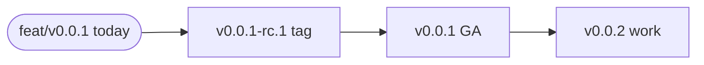
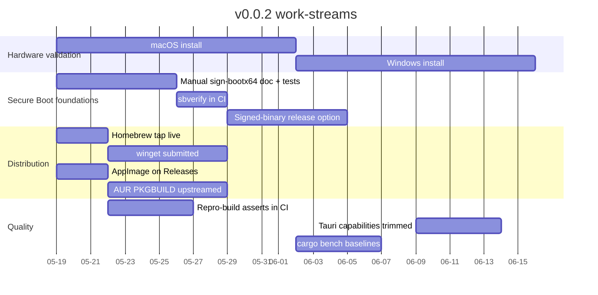
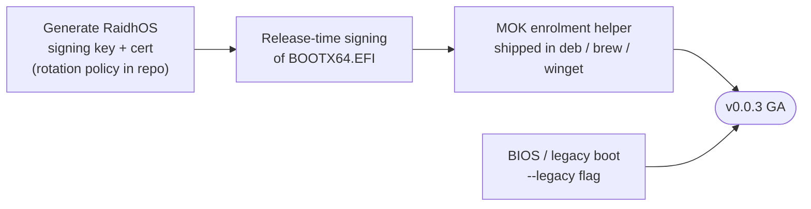
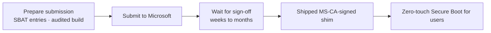

<!-- SPDX-License-Identifier: GPL-3.0-only -->

# Roadmap

Where RaidhOS is going. For "what's in *this* release", see
[`V0_0_1_STATUS.md`](V0_0_1_STATUS.md). For "what *changed*
release-by-release", see [`CHANGELOG.md`](../CHANGELOG.md).

This document is the source of truth for *direction*. Items are
ordered by priority within each milestone; the *order between*
milestones is fixed.

---

## Contents

- [Current milestone — v0.0.1](#current-milestone--v001)
- [v0.0.2 — hardware validation + Secure Boot foundations](#v002--hardware-validation--secure-boot-foundations)
- [v0.0.3 — Secure Boot live](#v003--secure-boot-live)
- [v0.1.0 — first stable](#v010--first-stable)
- [v1.0 — Microsoft UEFI CA target](#v10--microsoft-uefi-ca-target)
- [Continuous improvements](#continuous-improvements)
- [Explicitly not on the roadmap](#explicitly-not-on-the-roadmap)

---

## Current milestone — v0.0.1

**Status: feature-complete on `feat/v0.0.1`.** Awaiting
maintainer authorisation to push the `v0.0.1-rc.1` tag.

Highlights of what's in v0.0.1 (full list in
[`V0_0_1_STATUS.md`](V0_0_1_STATUS.md)):

- Tauri 2 UI with strict CSP, drag-and-drop, WCAG 2.2 AA,
  light theme, three-step wizard.
- macOS and Windows install pipelines **code-complete**
  (hardware validation in v0.0.2).
- ISO catalog with GPG signature verification.
- Persistence overlays (Linux).
- seccomp denylist + TOCTOU fd pin (Linux).
- Reproducible Docker-pinned GRUB build.
- cosign keyless signing + SLSA L3 provenance + CycloneDX SBOM
  in CI.
- OpenSSF Scorecards + CodeQL + cargo-deny + fuzz smoke
  workflows.
- Distribution packaging seeds for Homebrew, winget, deb,
  AppImage.

---

## v0.0.2 — hardware validation + Secure Boot foundations

**Target window**: 2026-05-19 → 2026-06-16 (≈4 weeks).

Definition of done:

- macOS install validated on at least one Apple Silicon and
  one Intel Mac, against an external USB SSD.
- Windows install validated on at least one x86_64 PC.
- `tools/secureboot/sign-bootx64.sh` documented with a working
  example signing key and an `sbverify` step in CI.
- Homebrew tap installable end-to-end.
- winget manifest accepted by `microsoft/winget-pkgs`.
- AppImage build script produces a working portable binary.
- `cargo bench` baselines committed (parsers, validation,
  payload hash).

---

## v0.0.3 — Secure Boot live

**Target window**: ~2 months after v0.0.2.

Definition of done:

- A published RaidhOS signing key with documented rotation
  policy.
- Every release ships a signed `BOOTX64.EFI`.
- `scripts/raidhos-mok-enroll.sh` packaged so end users can run
  it without `cargo build`.
- `--legacy` flag in the install pipeline produces a stick
  bootable on BIOS-only firmware.
- macOS sandbox profile + Windows AppContainer for the helper
  (defence-in-depth equivalent of Linux's seccomp).
- BLAKE3 alongside SHA-256 for internal integrity (payload
  hash 5× faster).

---

## v0.1.0 — first stable

**Target window**: ~6 months after v0.0.1.

The semantic-versioning contract becomes binding here. Before
v0.1.0, anything can break between releases; after, breaking
changes go through a major bump.

Highlights:

- Library API surface stabilised. Public types in
  `raidhos-core` are part of the contract.
- CLI argv schema stabilised. Helper argv schema stabilised.
- ISO catalog grows to 15+ distros.
- Curated MOK key well-known across distros (Debian / Ubuntu
  / Fedora package maintainers signed off).
- Streaming SHA-256 / BLAKE3 during ISO copy so verification
  is single-pass.
- Tauri 2 capabilities trimmed to per-command minimum.
- `cargo bench` regressions caught in CI.
- i18n scaffolding (English-only still default; one community
  translation accepted as proof of concept).

---

## v1.0 — Microsoft UEFI CA target

**Target window**: ~12 months after v0.0.1.

This is aspirational. The dependency on Microsoft's process
means we can't pin a date. If the sign-off is rejected or
delayed beyond v1.0, the existing MOK path stays canonical.

Other v1.0 deliverables:

- 2+ active maintainers (see [`GOVERNANCE.md`](GOVERNANCE.md)).
- Reproducible builds verified across distros (Debian
  Reproducible Builds project ingestion).
- A widely-cited threat model (review by ≥1 external
  security researcher; published findings).
- Public RFC process for breaking changes.

---

## Continuous improvements

These run alongside milestones and don't gate any release:

- **Documentation**. The bar is "every user-facing claim has
  a verifiable citation." Drift means PR.
- **Fuzzing**. Add corpus seeds; run longer campaigns on the
  trust-boundary parsers.
- **Audit**. `cargo audit`, `cargo deny`, OpenSSF Scorecards
  remain weekly cron + every-PR.
- **Performance**. `cargo bench` baselines + regression
  alerts.
- **Translations**. Once i18n scaffolding lands, community
  translations welcome through normal PR flow.

---

## Explicitly not on the roadmap

These are recurring asks; documented here so we don't have to
re-litigate.

| Ask | Decision |
|---|---|
| Telemetry / phone-home | **No.** Privacy is a design tenet. |
| Cloud-based GRUB build service | **No.** Reproducibility depends on local build determinism. |
| BSD support | Not before v1.0. Linux / macOS / Windows are the focus. |
| Mobile (Android / iOS) support | **No.** Sandbox model precludes block-device access. |
| Bundling Ventoy's binaries directly | We currently bundle the *payload*; we won't bundle their binaries. The reproducible-build story is our differentiator. |
| Commercial support contracts | **Not the maintainer's business model.** Channel partners may offer this; upstream does not. |
| Re-licensing | **No.** GPL-3.0-only matches our runtime dependencies and our intent. |

If you'd like one of these reconsidered, an RFC issue is the
right path — but expect the same answer in the absence of new
information.
