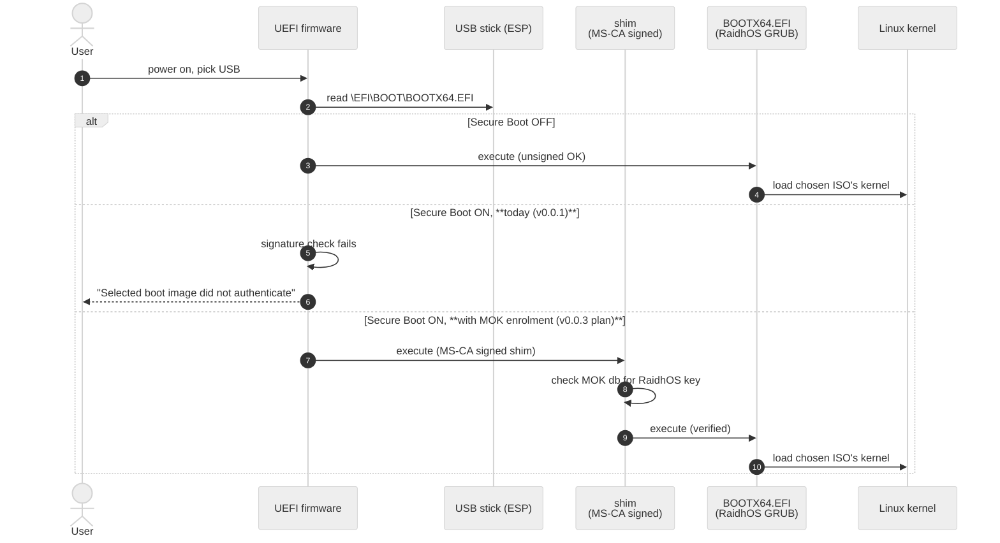
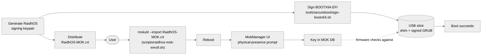

<!-- SPDX-License-Identifier: GPL-3.0-only -->

# Secure Boot

## TL;DR

**RaidhOS v0.0.1 does not boot under Secure Boot.** The
`BOOTX64.EFI` we ship is reproducibly built and cosign-signed
for download integrity, but it is **not** signed under a key
the firmware trusts. To boot a RaidhOS stick today: disable
Secure Boot in firmware, boot the USB, re-enable Secure Boot
after.

The v0.0.2 plan (MOK enrolment) is below.

---

## Contents

- [Why it fails today](#why-it-fails-today)
- [Where Secure Boot fits in the boot chain](#where-secure-boot-fits-in-the-boot-chain)
- [Verifying the unsigned binary](#verifying-the-unsigned-binary)
- [The path to signed boot](#the-path-to-signed-boot)
- [MOK enrolment: how it will work](#mok-enrolment-how-it-will-work)
- [Roadmap](#roadmap)
- [Disabling Secure Boot — step by step](#disabling-secure-boot--step-by-step)
- [Why not "just" use `grub2-signed`?](#why-not-just-use-grub2-signed)

---

## Why it fails today

The `BOOTX64.EFI` shipped by RaidhOS is produced by
`grub-mkstandalone` ([`tools/grub/build_grub.sh`](../tools/grub/build_grub.sh)).
The output is **not signed by any firmware-trusted key**.
Firmware with Secure Boot on will only execute binaries signed
by:

- Microsoft's UEFI CA, **or**
- a key the user has enrolled into the platform / MOK database.

The default RaidhOS binary is neither. This is not a bug, it is
a missing release-time step. Closing it is a v0.0.2 → v0.0.3
roadmap item.

---

## Where Secure Boot fits in the boot chain



---

## Verifying the unsigned binary

Even though the binary isn't signed for *firmware* trust, the
**release integrity** trust is recoverable. Every release of
`BOOTX64.EFI` ships with:

- A SHA-256 (`BOOTX64.EFI.sha256`).
- A cosign keyless signature (`BOOTX64.EFI.sig` + `.pem`).
- A SLSA L3 build-provenance attestation.

So you can verify the file you downloaded **is the file we
built** — see [`VERIFY.md`](VERIFY.md). That is not the same as
firmware trust, but it is a meaningful integrity guarantee.

---

## The path to signed boot

There are three credible options, in increasing order of effort
and quality. The RaidhOS plan is **Option 1 → Option 3**,
parallel-tracked.

### Option 1 — Use the upstream signed shim (recommended)

The `shim-signed` package, maintained by Debian / Ubuntu,
contains a small first-stage bootloader signed by Microsoft. It
loads a second-stage bootloader (typically `grubx64.efi`)
verified against a key the user has either pre-enrolled via MOK
(Machine Owner Key) or distributed in the shim's own database.



Trade-off: users have to enrol the key **once**. Industry
standard — this is exactly the path NixOS, Pop!_OS, Tumbleweed
and most third-party boot images use.

### Option 2 — Bundle a known-good signed shim from another project

For example, bundle Ventoy's published, Microsoft-CA-signed
shim unchanged. Faster to ship, but ties RaidhOS to an external
project's release cadence and key-rotation policy. Reasonable
bridge, not a destination.

### Option 3 — Pursue Microsoft UEFI CA signing for the RaidhOS shim itself

Microsoft will sign third-party shims that meet specific
requirements (SBAT entries, no-revoke-list, audited
build/signing process). Process takes weeks to months. Pay-off
is highest: zero-touch Secure Boot for users.

---

## MOK enrolment: how it will work

Once we ship signed binaries (v0.0.3 target), the user flow is:

1. Download the release.
2. Install RaidhOS as usual (your package manager handles
   placement).
3. Run the enrolment helper once per machine:

   ```bash
   sudo ./scripts/raidhos-mok-enroll.sh /usr/share/raidhos/RaidhOS-MOK.crt
   ```

4. Reboot. The firmware's MokManager screen appears and asks
   for the one-time password you set in step 3.
5. Confirm; reboot completes; the key is now in the MOK
   database.
6. Future boots of any RaidhOS USB are silent.

The signing script ([`tools/secureboot/sign-bootx64.sh`](../tools/secureboot/sign-bootx64.sh))
already wraps `sbsigntool`'s `sbsign` to produce the signed
binary; the enrolment helper
([`scripts/raidhos-mok-enroll.sh`](../scripts/raidhos-mok-enroll.sh))
already wraps `mokutil --import` with a clear physical-presence
rationale. What's missing for v0.0.3 is the **published RaidhOS
signing key** and the **release-workflow step that signs the
binary with it**.

---

## Roadmap

| Version | Deliverable |
|---|---|
| **v0.0.1 (current)** | Reproducible build · cosign signed · SLSA attested · documented disable workaround |
| **v0.0.2** | Detailed Option-1 docs · manual signing script tested against a user-supplied key · sbverify check in CI |
| **v0.0.3** | Published RaidhOS signing key · signed `BOOTX64.EFI` per release · MOK enrolment helper shipped in packages |
| **v0.1.x** | Investigate Option 3 (Microsoft UEFI CA shim sign-off) |
| **v1.0** | Either Option 3 lands or Option 1 stays canonical |

---

## Disabling Secure Boot — step by step

If you need to boot a RaidhOS stick **today**:

1. Save your work and reboot.
2. Enter firmware setup (usually <kbd>Del</kbd>, <kbd>F2</kbd>,
   <kbd>F10</kbd>, or <kbd>F12</kbd> immediately after power on
   — vendor-specific).
3. Find **Secure Boot** under a `Security`, `Boot`, or
   `Authentication` menu.
4. Set it to **Disabled** (some firmwares offer **Setup Mode**
   instead — both work).
5. Save and exit.
6. Boot the USB from the firmware boot menu.
7. **Re-enable Secure Boot** once you are done. It protects
   you from a real class of attacks.

If your firmware refuses to let you disable Secure Boot (some
enterprise-locked laptops): RaidhOS does not currently have a
workaround for v0.0.1. Wait for v0.0.3 (MOK) or use an
already-signed Linux installer for that one boot.

---

## Why not "just" use `grub2-signed`?

`grub2-signed` exists in Debian / Ubuntu repos, but it is
signed against a specific bootloader configuration and
revocation timeline that those distributions own. Embedding it
in a third-party project tends to break across kernel / GRUB
updates and SBAT revisions — every time the upstream
distribution rotates, our users get stranded on whatever
revocation list shipped at build time.

Option 1 (our own signing key, enrolled via MOK) gives us full
control without locking us to any distro's release cadence.

---

## See also

- [`THREAT_MODEL.md`](THREAT_MODEL.md) — where firmware-level
  attackers sit (out of scope) and how Secure Boot would shrink
  the surface.
- [`VERIFY.md`](VERIFY.md) — verifying the release-integrity
  signatures we already ship.
- [`tools/secureboot/sign-bootx64.sh`](../tools/secureboot/sign-bootx64.sh)
  — the user-callable signing script.
- [`scripts/raidhos-mok-enroll.sh`](../scripts/raidhos-mok-enroll.sh)
  — the user-callable MOK enrolment script.
