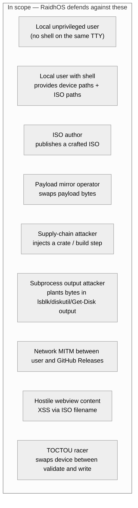
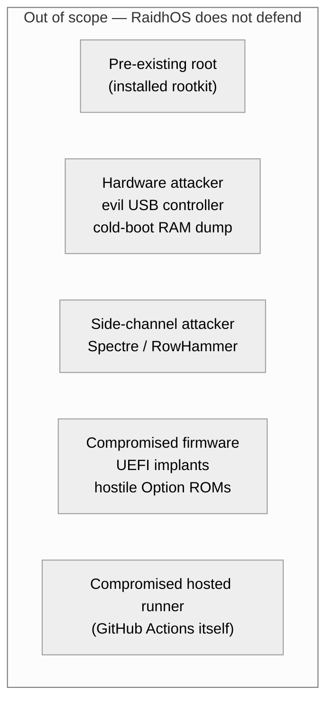
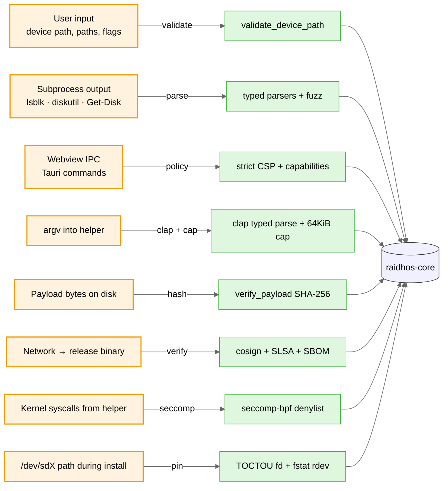
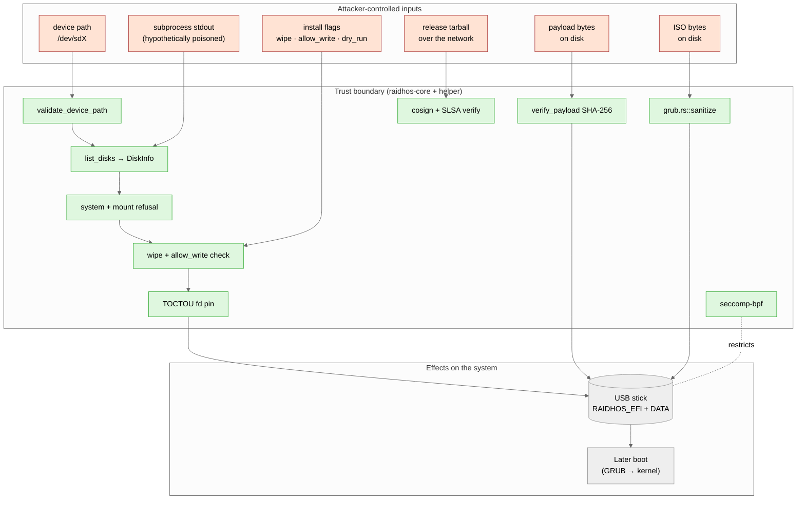

<!-- SPDX-License-Identifier: GPL-3.0-only -->

# Threat model

RaidhOS reads and writes raw block devices. The blast radius of a
single bug is "the user's data on the targeted disk, plus whatever
they later boot from it." This document names every attacker
RaidhOS defends against, every attacker it doesn't, and which
controls cover which.

Pair with [`HARDENING.md`](HARDENING.md) (the controls
themselves, with `file:line` citations).

---

## Contents

- [Assets](#assets)
- [STRIDE summary](#stride-summary)
- [Attackers in scope](#attackers-in-scope)
- [Attackers explicitly out of scope](#attackers-explicitly-out-of-scope)
- [Boundaries and controls](#boundaries-and-controls)
- [Attack-surface dataflow](#attack-surface-dataflow)
- [Defence layers](#defence-layers)
- [Residual risk](#residual-risk)
- [What "secure" means here](#what-secure-means-here)

---

## Assets

| # | Asset | Why it matters |
|---|---|---|
| A1 | The user's **system disk** | A flash that lands on the wrong device loses an OS. The blast radius is total. |
| A2 | The **bytes booted into** at next reboot | A tampered ISO, a tampered GRUB binary, or a tampered payload pivots the next boot into attacker-controlled code. |
| A3 | The user's **polkit / sudo credentials** | Briefly cached by `auth_admin_keep`. A local attacker could try to ride that window. |
| A4 | The **integrity of `raidhos-priv-helper`** while elevated | Anything it parses while running as root must be hostile-input-safe. |
| A5 | The **release supply chain** — signed binaries on GitHub | A poisoned release reaches every user, not just a single victim. |

---

## STRIDE summary

| Category | Concern | Primary control |
|---|---|---|
| **S**poofing | Attacker substitutes a malicious release binary | cosign keyless sig, SLSA L3, SHA-256, transparency log |
| **T**ampering | Hostile payload bytes between download and write | `payload/manifest.json` SHA-256 verification (`verify_payload`) |
| **R**epudiation | Privileged action with no audit trail | JSON-over-stdout response; polkit auth event logged by the OS |
| **I**nformation disclosure | Helper leaks credentials or state | Helper runs to completion + exits; no daemon; no log file with secrets |
| **D**enial of service | Resource exhaustion in helper | 64 KiB argv cap; `Command::new` argv (no shell); seccomp denylist refuses `bpf` / `userfaultfd` |
| **E**levation of privilege | Local user without admin triggers install | Polkit `allow_any=no`, `allow_inactive=no`; no setuid; no daemon |

---

## Attackers in scope

| Attacker | Capabilities | Key controls |
|---|---|---|
| **A1** — local unprivileged user | Read world-readable files, run any unprivileged tool, but **cannot** authenticate as admin | Polkit `allow_any=no`, `allow_inactive=no`; no setuid; helper requires explicit elevation |
| **A2** — local user with shell, **is** an admin | Provides device paths, payload dirs, install flags | Per-OS device-path allowlist + shell-metachar reject + path-traversal reject; system-disk refusal; mount-state refusal; double opt-in (`wipe` + `allow_write`); helper argv-length cap |
| **A3** — adversary controlling an ISO | Crafts ISO with hostile layout, hostile kernel, hostile filenames | ISO never executes during install. GRUB chains into it on later boot — Secure Boot is the long-term mitigation. ISO **filenames** are sanitised before they reach the generated `grub.cfg` ([`grub.rs:sanitize`](../crates/ui-tauri/src-tauri/src/grub.rs)). |
| **A4** — adversary on the payload mirror | Replaces `esp/` or `data/` contents between download and install | `verify_payload()` walks the payload tree, computes a path-prefixed SHA-256, compares against `payload/manifest.json:checksum`. Advisory in v0.0.1, fatal once the manifest is pinned. |
| **A5** — supply-chain attacker | Injects a malicious crate or build step | `cargo deny` (advisories + licenses + sources); pinned Rust toolchain; pinned Docker base image by digest; SLSA L3 provenance; cosign keyless signing; CycloneDX SBOM published per release |
| **A6** — adversary controlling subprocess output | Plants malicious bytes in `lsblk` / `diskutil` / `Get-Disk` stdout | Hand-rolled parsers with explicit shape; cargo-fuzz targets over all three (`fuzz/fuzz_targets/parse_*`); strict `deny_unknown_fields`-equivalent on helper inputs |
| **A7** — network MITM | Replaces the release tarball or the SHA-256 manifest | cosign keyless signature with project-bound OIDC subject; SLSA L3 attestation queryable via `gh attestation verify`; Rekor transparency log inclusion; `SHA256SUMS` manifest from the same release |
| **A8** — hostile webview content | Renders attacker-controlled string in the DOM as HTML | Strict CSP: `default-src 'self'`, no `'unsafe-inline'` for either scripts or styles, `object-src 'none'`, `frame-ancestors 'none'`, `form-action 'none'` |
| **A9** — TOCTOU racer | Swaps a symlink or hot-plugs a different USB at the same `/dev/sdX` path between validate and write | Helper opens device fd at validate time, snapshots `rdev` via `fstat`, holds the fd open for the install duration ([`priv-helper/src/toctou.rs`](../crates/priv-helper/src/toctou.rs)) |

---

## Attackers explicitly out of scope

These are well-known limitations, not surprise gaps.

- **Pre-existing root / Administrator on the host machine.**
  RaidhOS is not a rootkit-defeating tool. If the attacker
  already controls the OS, they can substitute the binary,
  modify the polkit policy, snoop the user's keystrokes,
  etc. — well before RaidhOS gets a say.
- **Hardware attackers.** Cold-boot DRAM extraction, evil-USB
  controllers presenting different geometry to host vs
  target, JTAG access — all out of scope.
- **Side-channel attackers** on the host (Spectre-class,
  RowHammer). The library does no secret-key crypto, but
  callers might.
- **Compromised firmware.** UEFI implants, hostile Option
  ROMs, BMC firmware. Secure Boot helps once we ship it, but
  the trust is rooted in the firmware itself.
- **Compromised GitHub Actions infrastructure.** SLSA L3
  binds the provenance to the runner's OIDC token; if the
  hosted runner platform is compromised the signature is
  still cryptographically valid but the build can lie. This
  is the GitHub-Actions threat model boundary, not ours.

---

## Boundaries and controls

Detailed mapping with `file:line` references:
[`HARDENING.md`](HARDENING.md).

---

## Attack-surface dataflow

What an attacker controls vs what RaidhOS controls, end-to-end:

---

## Defence layers

RaidhOS practises **defence in depth**. Every destructive
operation has to clear *at least two independent guards*. If a
single guard has a bug, the install still fails closed.

| Guard | Independent of | Catches |
|---|---|---|
| `validate_device_path` | Discovery state | Shell metacharacters, path traversal, wrong-shape paths |
| System-disk refusal | `validate_device_path` | The user mistyping `/dev/sda` for the system disk |
| Mount-state refusal | System-disk refusal | A disk that is technically removable but currently mounted |
| `wipe == true` opt-in | All the above | The user reusing an old command without expecting destruction |
| `allow_write == true` opt-in | `wipe` | A dry-run that gets accidentally re-purposed |
| `verify_payload` SHA-256 | Everything else | A swapped payload mirror after the binaries were verified |
| seccomp-bpf denylist | Everything else | Post-compromise escalation primitives (ptrace, bpf, kexec…) |
| TOCTOU fd pin | All path-based checks | A symlink swap or USB hot-plug after validate |
| `sanitize()` + `sanitize_username()` + `is_grub_pbkdf2_hash()` | Hostile ISO filenames, hostile boot-entry titles, hostile auto-install paths | GRUB metachar escape into the rendered grub.cfg (every field that flows in: title, path, params, kargs, class, tip, persistence_backend, conf_replace_path, autoinstall.path, grub_superuser, default_entry, data_label) |
| Property test sweeps every byte 0..128 + CVE-corpus payloads against the sanitiser | Field-by-field test gaps | A new field added later that skips the sanitiser |

---

## Residual risk

These are known limitations, currently mitigated by external
controls or accepted as inherent.

| Risk | Mitigation today | Plan |
|---|---|---|
| `payload/manifest.json:checksum` is empty during dev | Advisory warning, not fatal | Populate during release; make mismatch fatal in v0.0.2 |
| ISO signature verification depends on `gpg(1)` on PATH | Documented; clear error if missing | Bundle a curated keyring; consider pure-Rust verifier in v1.0 |
| Tauri 2 capabilities permit broad `core:*` for compatibility | Per-command audit | Trim to the minimum required set in v0.0.2 |
| Linux-only seccomp + TOCTOU | macOS/Windows have different primitives | macOS `proc_pidpath` + audit + Hypervisor.framework hardening; Windows job objects + AppContainer in v0.0.3 |
| Helper has no signed-input mode (any caller can hand it argv) | pkexec gate before invocation | Optional shared-secret handshake with the UI in v0.1.0 (defence in depth, not the primary gate) |

---

## What "secure" means here

We do not claim "100% secure." We claim:

1. **Memory-safe core.** Zero `unsafe` blocks, enforced at
   compile time across the workspace.
2. **Privilege-minimised architecture.** Exactly one binary
   runs as root, and that binary parses a tiny, strict input.
3. **Defence in depth.** Every destructive operation passes
   through at least two independent guards.
4. **Auditable supply chain.** Pinned deps, license audit,
   advisory audit, signed releases, SBOM, SLSA L3 provenance,
   OpenSSF Scorecards.
5. **Transparent threat model.** This document, and the
   `file:line` citations in [`HARDENING.md`](HARDENING.md), so
   reviewers can hold us to it.

When this document drifts from the code, the code is wrong and
should be fixed — not the document.
