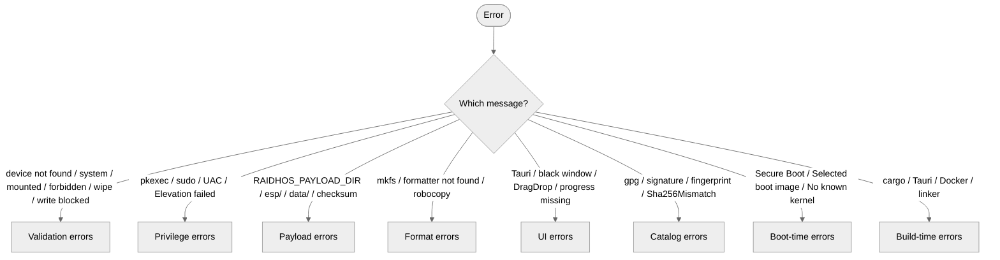

<!-- SPDX-License-Identifier: GPL-3.0-only -->

# Troubleshooting

A flat index of every error message RaidhOS produces, what it
means, and how to recover.

If you hit something not covered here, please open an issue
with the `raidhos-cli list-disks` output and the exact command
you ran. Security issues go through [`SECURITY.md`](../SECURITY.md),
not public issues.

---

## Contents

- [Quick diagnostic flow](#quick-diagnostic-flow)
- [Validation errors](#validation-errors)
- [Privilege / elevation errors](#privilege--elevation-errors)
- [Payload errors](#payload-errors)
- [Format / filesystem errors](#format--filesystem-errors)
- [UI errors](#ui-errors)
- [Catalog / GPG errors](#catalog--gpg-errors)
- [Boot-time errors](#boot-time-errors)
- [Build-time errors](#build-time-errors)
- [Reverting a stick](#reverting-a-stick)

---

## Quick diagnostic flow



---

## Validation errors

### `device not found`

The device path you passed isn't in the list of discovered
disks. Causes:

- The USB has been unplugged / remounted — re-run `list-disks`.
- You typed the wrong letter (`/dev/sdb` vs `/dev/sdc`).
- Your USB is masked behind a hub that doesn't report on
  hotplug — try a direct port.
- (macOS) The path uses an underscore or a slice (`disk2s1` is
  a partition, not a disk).

### `refusing to operate on system disk`

The disk you targeted is either mounted at `/`, `/boot`, or
`/boot/efi` (Linux); flagged `Internal: true` (macOS); or
`IsSystem`/`IsBoot: true` (Windows). **This is by design.**

If you genuinely believe the detection is wrong (e.g. an
external Thunderbolt SSD reported as internal on macOS), open
an issue with the full discovery output.

### `device has mounted partitions; unmount first`

Auto-mounting is in your way:

```bash
# Linux:
sudo udisksctl unmount -b /dev/sdX1
sudo udisksctl unmount -b /dev/sdX2
# or, bluntly:
sudo umount /dev/sdX?*

# macOS:
diskutil unmountDisk /dev/diskN

# Windows (PowerShell, elevated):
Get-Partition -DiskNumber N | Remove-PartitionAccessPath -AccessPath (...)
```

Then re-run the install.

### `device path contains forbidden character`

RaidhOS rejects shell metacharacters, control bytes, and `..`
in device paths. The full list is `validate_device_path`'s
`FORBIDDEN` constant in
[`crates/core/src/lib.rs`](../crates/core/src/lib.rs).

If the path is somehow being constructed with shell
substitutions (`/dev/sd$(echo b)`), use a literal path
instead.

### `wipe flag must be set for destructive install`

You ran the helper with `--no-wipe`. That flag is debug-only;
the install will refuse. Drop the flag (the default is
`wipe=true`).

### `write blocked: set allow_write to proceed`

You ran without `--allow-write`. By design — that's the second
of two opt-ins. Add `--allow-write` once you're sure.

### `device must be an absolute /dev path` / `/dev/diskN` / `\\.\PhysicalDriveN`

You're invoking the wrong-shape path for the OS. Use:

| OS | Shape |
|---|---|
| Linux | `/dev/sdX`, `/dev/nvme0n1`, `/dev/mmcblk0` |
| macOS | `/dev/diskN` (whole disk; never `diskNsM`) |
| Windows | `\\.\PhysicalDriveN` (case-insensitive) |

---

## Privilege / elevation errors

### `pkexec` opens, you authenticate, install still fails

The helper prints its detailed error on stderr; the UI surfaces
only the JSON `error` field. Run the helper directly to see the
full output:

```bash
sudo RAIDHOS_PAYLOAD_DIR=/path/to/payload \
  raidhos-priv-helper install --device /dev/sdX --allow-write
```

Common causes:

- `RAIDHOS_PAYLOAD_DIR` not exported across the `sudo`
  boundary. Use `sudo -E` or set the variable inline.
- `mkfs.exfat` or `mkexfatfs` missing — install `exfatprogs`.
- The polkit policy is not installed. Either install the deb
  package (which places it), or copy
  [`packaging/linux/org.raidhos.policy`](../packaging/linux/org.raidhos.policy)
  to `/usr/share/polkit-1/actions/`. Or invoke the helper
  through `sudo` directly.

### `Elevation failed or was cancelled by user`

You dismissed the privilege prompt. The install did not run.

### macOS: `osascript` error, "do shell script with administrator privileges"

- Confirm the helper is at the same directory as
  `raidhos-ui`. The UI looks for `raidhos-priv-helper` next to
  its own binary.
- Confirm the install isn't being launched via a sandboxed
  process (the App Sandbox blocks `osascript`).

### Windows: UAC dialog flashes and closes

The helper exits immediately if the device path is malformed.
Run the helper directly in an elevated PowerShell to see the
JSON error:

```powershell
raidhos-priv-helper.exe install --device \\.\PhysicalDrive3 --allow-write
```

---

## Payload errors

### `RAIDHOS_PAYLOAD_DIR is not set`

Set it on the same command line:

```bash
sudo RAIDHOS_PAYLOAD_DIR=/srv/raidhos/payload-1.1.10 \
  raidhos-priv-helper install ...
```

`sudo -E` or inline assignment will preserve it; plain `sudo`
strips it.

### `RAIDHOS_PAYLOAD_DIR does not exist`

The path is typo'd or you haven't staged the payload yet. See
[`PAYLOAD.md`](PAYLOAD.md).

### `RAIDHOS_PAYLOAD_DIR must contain esp/ and data/ directories`

The layout is wrong. See [`PAYLOAD.md`](PAYLOAD.md#directory-layout).

### `Payload integrity warning: payload checksum not pinned in manifest`

Advisory, not fatal. `payload/manifest.json:checksum` is empty
during development; the install continues. Will become fatal in
v0.0.2.

### `Payload integrity warning: payload checksum mismatch …`

The tree differs from the manifest. **Stop**, re-stage from a
known-good source, and verify upstream.

---

## Format / filesystem errors

### `exFAT formatter not found (mkfs.exfat or mkexfatfs)`

Install one of the exFAT toolchains:

| Distro | Package |
|---|---|
| Debian, Ubuntu | `exfatprogs` |
| Arch | `exfatprogs` |
| Fedora | `exfatprogs` |
| Older / deprecated | `exfat-utils` |

### Linux: `parted` errors with `Permission denied`

The helper isn't running with the right privileges. You ran the
CLI install instead of the helper.

### macOS: `diskutil partitionDisk` failure

- Confirm the disk isn't mounted (`diskutil unmountDisk`).
- Confirm you're hitting the **whole disk** (`disk2`), not a
  slice (`disk2s1`).
- (Apple Silicon Macs) check **System Settings → Privacy &
  Security → Full Disk Access**.

### Windows: `Clear-Disk` errors with `The disk has active page files`

You picked the wrong disk number. Use `Get-Disk` to identify
the USB, not the system disk.

### `robocopy failed: exit <N>`

`robocopy` uses non-zero exit codes for "success with info"
too. RaidhOS treats 0–7 as success; 8+ is a real failure. Look
at the prior console output for the underlying error.

---

## UI errors

### `error while running RaidhOS`

- Confirm OS-specific Tauri deps are installed (rerun the
  bootstrap script for your distro).
- On Linux Wayland: try
  `WEBKIT_DISABLE_DMABUF_RENDERER=1 raidhos-ui` if you see a
  black window.
- Run with `RUST_LOG=trace` for verbose output.

### Drag-and-drop "works" but ISOs don't appear in the menu

- Check that the target USB's DATA partition is mounted (the
  UI uses `selectedDataMount` for the copy).
- Filenames containing forbidden metacharacters
  (`$`, `` ` ``, …) are sanitised in the generated `grub.cfg`
  but might still be confusing in the menu. Rename and
  re-drop.

### Progress is silent

The push events live at `raidhos://progress`. If they fail to
fire, the install still runs but you see nothing until it
finishes. Check the JavaScript console (UI's webview) for
errors.

### "Selected device disappeared" mid-install (Linux)

The TOCTOU defence fired — the device path or its `rdev`
changed between validate and write. This is correct. Re-run
list-disks; do not coerce.

---

## Catalog / GPG errors

### `gpg(1) not found on PATH`

Install GPG. On macOS: `brew install gnupg`. On Linux:
`sudo apt-get install gpg` or distribution equivalent.

### `public key for fingerprint <FP> is not bundled`

The catalog references a key that isn't shipped in
`catalog/keys/<FP>.asc`. Either:

- Update RaidhOS (we may have added the key in a later
  release).
- Drop the `.asc` file in `catalog/keys/` yourself, verified
  out-of-band per [`catalog/keys/README.md`](../catalog/keys/README.md).

### `signature verification failed: BAD signature`

The signature file doesn't match the SHA256SUMS. **Stop**. The
file you downloaded is either corrupt or tampered. Re-download
from the distro's official mirror.

### `sha256 mismatch: expected <a> computed <b>`

The signature was valid, but the ISO's hash didn't match the
recorded one. **Stop**. Re-download.

### `filename <foo>.iso not present in SHA256SUMS`

The ISO file name doesn't appear in the SHA256SUMS the catalog
points at. Cause: the catalog entry's `iso_filename` is stale
(distro renamed the ISO between releases). Update the entry or
pin the older ISO.

---

## Boot-time errors

### `Selected boot image did not authenticate`

Secure Boot rejected the unsigned `BOOTX64.EFI`. See
[`SECURE_BOOT.md`](SECURE_BOOT.md) — disable Secure Boot,
re-enable after, or wait for v0.0.3 (signed binaries + MOK).

### `No known kernel path found in ISO.`

The GRUB config heuristics in
[`crates/ui-tauri/src-tauri/src/grub.rs`](../crates/ui-tauri/src-tauri/src/grub.rs)
recognise `casper/` (Debian/Ubuntu live) and `live/` (Debian
Live). ISOs shipping their own `boot/grub/grub.cfg` on the ISO
root are also picked up via `configfile`. Other layouts fall
through.

Workaround: open an issue with the ISO name and the output of:

```bash
isoinfo -i your.iso -l | head -30
```

We'll add the layout in the next release.

### USB doesn't appear in firmware boot menu

- Confirm you booted into the firmware menu (vendor-specific
  key — usually <kbd>F12</kbd>).
- Confirm Secure Boot is disabled, or you've enrolled the
  RaidhOS MOK key (v0.0.3+).
- Confirm the stick is on a USB 2.0 port if your firmware
  doesn't probe USB 3.0 at POST.

---

## Build-time errors

### `tauri-build` fails on Linux

Install the WebKit2GTK 4.1 dev headers. Bootstrap script:
[`scripts/bootstrap-debian.sh`](../scripts/bootstrap-debian.sh)
and friends.

### `cargo install` complains about MSRV

We pin MSRV at 1.78. Update your toolchain:

```bash
rustup update stable
```

### Coverage gate failure on PR (CI)

`cargo tarpaulin -p raidhos-core --fail-under 95` is strict by
design. If you added code without tests, the gate will block
the PR. Add unit tests in the right `platform/{linux,macos,
windows}.rs` or `parsers.rs` and re-push.

### Tauri 2 build fails with `frontendDist` not found

The Tauri 2 schema renamed `distDir` to `frontendDist`. If you
hand-edited `tauri.conf.json` make sure to use the v2 schema.

### Docker build fails: `manifest unknown` on `debian:bookworm-slim@sha256:…`

The Docker base image digest in
[`tools/grub/Dockerfile`](../tools/grub/Dockerfile) was bumped
upstream. Pull the latest tag (`docker pull debian:bookworm-slim`),
read its digest (`docker images --digests debian:bookworm-slim`),
and update the `Dockerfile`.

---

## Reverting a stick

To turn a RaidhOS USB back into a plain FAT32 stick:

```bash
# Linux
sudo wipefs -a /dev/sdX
sudo parted /dev/sdX -s mklabel msdos
sudo parted /dev/sdX -s mkpart primary fat32 1MiB 100%
sudo mkfs.vfat -F 32 /dev/sdX1

# macOS
diskutil eraseDisk MS-DOS FAT32 MBRFormat /dev/diskN

# Windows (PowerShell, elevated)
Clear-Disk -Number N -RemoveData -Confirm:$false
Initialize-Disk -Number N -PartitionStyle MBR
New-Partition -DiskNumber N -UseMaximumSize -AssignDriveLetter |
  Format-Volume -FileSystem FAT32 -NewFileSystemLabel USB -Confirm:$false
```
