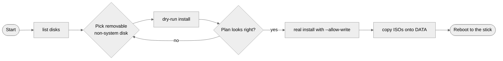
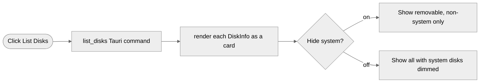
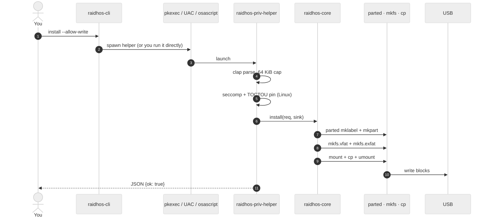
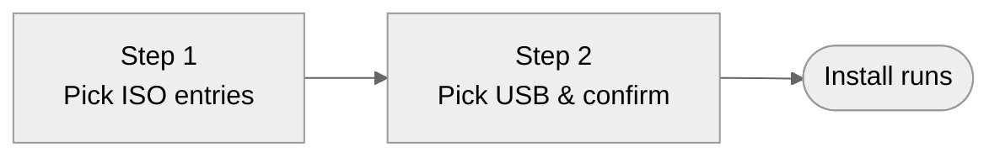
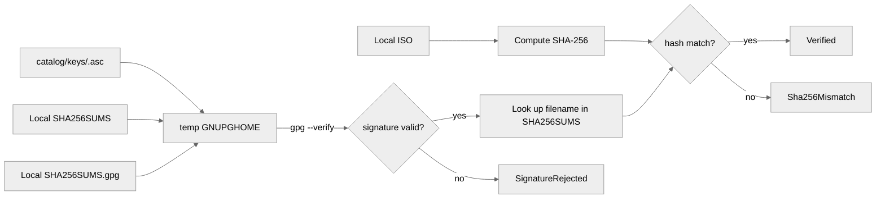

<!-- SPDX-License-Identifier: GPL-3.0-only -->

# User guide

A walkthrough of installing your first multi-ISO USB with
RaidhOS. Once you've finished this guide, you'll have a USB
stick that boots into any of several Linux distributions from a
single boot menu.

> **v0.0.1 platform reality.** Linux is end-to-end. macOS and
> Windows can list, validate, and dry-run today; the destructive
> install path is wired but **needs hardware validation**. See
> [`V0_0_1_STATUS.md`](V0_0_1_STATUS.md).

---

## Contents

- [Before you start](#before-you-start)
- [Step 1 — Install RaidhOS](#step-1--install-raidhos)
- [Step 2 — Inspect candidate disks](#step-2--inspect-candidate-disks)
- [Step 3 — Dry-run](#step-3--dry-run)
- [Step 4 — Real install](#step-4--real-install)
- [Step 5 — Copy ISOs](#step-5--copy-isos)
- [Step 6 — Boot the stick](#step-6--boot-the-stick)
- [Using the desktop UI](#using-the-desktop-ui)
- [Verifying an ISO before flashing](#verifying-an-iso-before-flashing)
- [Persistence](#persistence)
- [Reverting a USB stick](#reverting-a-usb-stick)
- [What next](#what-next)

---

## Before you start

You will need:

- A USB stick of **at least 16 GiB** (32 GiB if you want
  several large ISOs and/or persistence).
- One or more Linux ISOs already downloaded.
- Root / Administrator on the host machine for the destructive
  step.
- (Optional) `gpg(1)` on `$PATH` if you want to use the bundled
  ISO catalog to verify what you downloaded.

RaidhOS refuses to operate on your system disk, on any disk
mounted at `/`, `/boot`, or `/boot/efi`, and on any disk whose
partitions are currently mounted. You should still **back up
anything on the USB stick** — the install is destructive by
design.

The full safety model is in [`THREAT_MODEL.md`](THREAT_MODEL.md).
The high-level flow:



---

## Step 1 — Install RaidhOS

Pick the channel that matches your platform. Full details:
[`INSTALL.md`](INSTALL.md).

```bash
# Linux Debian/Ubuntu:
sudo dpkg -i raidhos_0.0.1_amd64.deb

# macOS:
brew tap sebastienrousseau/tap && brew install raidhos

# Windows:
winget install sebastienrousseau.RaidhOS

# Source (any OS):
git clone https://github.com/sebastienrousseau/raidhos.git
cd raidhos
cargo build --release --workspace --exclude raidhos-ui
```

---

## Step 2 — Inspect candidate disks

```bash
raidhos-cli list-disks
```

You will see one line per physical disk: the device path, model,
size in bytes, removable flag, system flag, and a
comma-separated list of mountpoints.

```text
/dev/sda Samsung SSD 980 1TB 1000204886016 removable=false system=true  mounts=/,/boot,/home
/dev/sdb USB DISK 3.0          32077825024 removable=true  system=false mounts=
```

Confirm:

- The USB stick is listed.
- `removable=true`.
- `system=false`.

If your USB is not listed at all, unplug it, wait two seconds,
plug it back in, and re-run.

The same operation in the UI:



---

## Step 3 — Dry-run

Always start with a dry-run. It performs every safety check but
writes nothing.

```bash
raidhos-cli install --device /dev/sdX --dry-run
```

```text
validate Validating target /dev/sdX 5%
prepare  Preparing partition layout 20%
payload  Staging payload 0.1.0 45%
write    Writing boot structures 70%
finalize Final checks 90%
complete Dry-run complete. No changes made. 100%
```

If the dry-run completes with no error you are good to proceed.

If it errors with `device not found`, `system disk`, `mounted`,
`forbidden character`, or `wipe flag` — go to
[`TROUBLESHOOTING.md`](TROUBLESHOOTING.md).

---

## Step 4 — Real install

This is the destructive step. It requires the privileged helper
and `--allow-write`.

```bash
sudo RAIDHOS_PAYLOAD_DIR=/path/to/payload \
  raidhos-priv-helper install \
  --device /dev/sdX \
  --allow-write
```

The helper:

1. Validates the device path against the per-OS allowlist.
2. Refuses to continue if the disk is mounted or system.
3. (Linux) Installs the seccomp denylist.
4. (Linux) Opens and pins the device fd via `fstat`.
5. Verifies the payload against `payload/manifest.json`.
6. Creates a GPT partition table.
7. Lays down `RAIDHOS_EFI` (FAT32, 33 MiB) and `DATA` (exFAT,
   rest of the disk).
8. Copies `esp/` and `data/` from `$RAIDHOS_PAYLOAD_DIR`.
9. Returns a JSON `{ok: true}` on stdout.

A 16 GiB stick on USB 3.0 finishes in 2.5 - 4 minutes depending
on payload size and host kernel.

Sequence:



---

## Step 5 — Copy ISOs

After the install, the DATA partition has a `boot/isos/` folder
ready for your ISOs.

```bash
# Linux
sudo mkdir -p /mnt/raidhos-data
sudo mount /dev/sdX2 /mnt/raidhos-data
sudo cp ~/Downloads/ubuntu-24.04-desktop-amd64.iso \
        /mnt/raidhos-data/boot/isos/
sudo umount /mnt/raidhos-data
```

```bash
# macOS — auto-mounts under /Volumes/DATA
cp ~/Downloads/ubuntu-24.04-desktop-amd64.iso \
   /Volumes/DATA/boot/isos/
```

```powershell
# Windows — drive letter assigned at install time
Copy-Item C:\Users\you\Downloads\ubuntu-24.04-desktop-amd64.iso `
          F:\boot\isos\
```

Or use the **UI's drag-and-drop**: pick the target USB, then drag
ISOs from your file manager into the RaidhOS window. The UI
routes them through `copy_isos_to_data` after the standard
safety checks.

You can also inventory ISOs already on your machine:

```bash
raidhos-cli scan-isos --dirs /home,/media,/mnt,/Downloads
```

---

## Step 6 — Boot the stick

Reboot. Enter your firmware's boot menu (usually <kbd>F12</kbd>,
<kbd>F11</kbd>, <kbd>F10</kbd>, or <kbd>Esc</kbd> during POST).
Pick the USB device. GRUB will present a menu generated from
the ISOs in `boot/isos/`.

If your machine has **Secure Boot** enabled the boot will fail
with a "Selected boot image did not authenticate" error. See
[`SECURE_BOOT.md`](SECURE_BOOT.md) for the workaround. Short
version: disable Secure Boot in firmware, boot the stick,
re-enable Secure Boot afterwards.

---

## Using the desktop UI

The UI is an alternative front-end for the same operations:

```bash
raidhos-ui    # or the .app bundle on macOS, or the Start Menu shortcut on Windows
```

The UI has a **toggleable wizard mode** that walks you through
two steps:



Toggle off (the default for power users) and you see the full
dashboard at once. Both modes feed the same install pipeline.

Other UI niceties:

- **Drag-and-drop ISOs.** Drop a `.iso` file anywhere on the
  window. The toast banner confirms how many were copied.
- **Push progress.** Each phase emits a live event; no polling.
- **Type-`ERASE`-to-confirm.** The install button stays disabled
  until you've typed the literal device path *and* "ERASE".
- **Light theme + a11y.** Honours `prefers-color-scheme`,
  `prefers-reduced-motion`, `prefers-contrast`. All interactive
  elements have ARIA labels. Keyboard-only flow works.

---

## Verifying an ISO before flashing

The bundled catalog ([`catalog/catalog.json`](../catalog/catalog.json))
contains the SHA256SUMS URL and GPG signing-key fingerprint for
several major distros. Use it to verify what you downloaded:

```bash
raidhos-cli catalog list
# debian-12-netinst-amd64  Debian 12 (Bookworm) — Netinst amd64
# ubuntu-24.04-desktop-amd64  Ubuntu 24.04 LTS Desktop amd64
# ...

raidhos-cli catalog verify \
    --slug ubuntu-24.04-desktop-amd64 \
    --iso  ~/Downloads/ubuntu-24.04.3-desktop-amd64.iso \
    --sums ~/Downloads/SHA256SUMS \
    --sig  ~/Downloads/SHA256SUMS.gpg
```

Verification runs in an **ephemeral GPG home** — it does not
touch your normal keyring.



---

## Persistence

Persistence creates an `ext4` overlay file on the DATA
partition. Live distros that recognise `persistence` /
`persistence.conf` will write data to it across reboots, so
your settings and downloaded files survive.

To request a persistence overlay during install, pass
`--persistence-mb N` to the helper (Linux only for now):

```bash
sudo RAIDHOS_PAYLOAD_DIR=/path/to/payload \
  raidhos-priv-helper install \
  --device /dev/sdX \
  --allow-write \
  --persistence-mb 4096
```

The helper will:

1. Run the normal install.
2. Mount DATA by label.
3. `dd if=/dev/zero of=<DATA>/persistence bs=1M count=N`.
4. `mkfs.ext4 -L persistence` on that file.
5. Write `persistence.conf` containing `/ union`.

Not all distros pick this up automatically; consult the distro's
live-session documentation.

---

## Reverting a USB stick

To turn a RaidhOS USB back into a plain FAT32 stick:

```bash
sudo wipefs -a /dev/sdX
sudo parted /dev/sdX -s mklabel msdos
sudo parted /dev/sdX -s mkpart primary fat32 1MiB 100%
sudo mkfs.vfat -F 32 /dev/sdX1
```

(macOS: `diskutil eraseDisk MS-DOS FAT32 MBRFormat /dev/diskN`.
Windows: Disk Management → right-click → *Format*, or
`Clear-Disk` + `New-Partition`.)

---

## What next

- Edit `~/.config/raidhos/boot.json` (or the platform
  equivalent in `directories::ProjectDirs`) to customise the
  GRUB menu — kernel parameters, default entry, etc.
- Open an issue if a distro's ISO doesn't boot — the GRUB
  config heuristics in
  [`grub.rs`](../crates/ui-tauri/src-tauri/src/grub.rs) only
  recognise a small set today; we add layouts on request.
- Read [`TROUBLESHOOTING.md`](TROUBLESHOOTING.md) if anything
  fails.
- Read [`FAQ.md`](FAQ.md) if you have a higher-level question.
