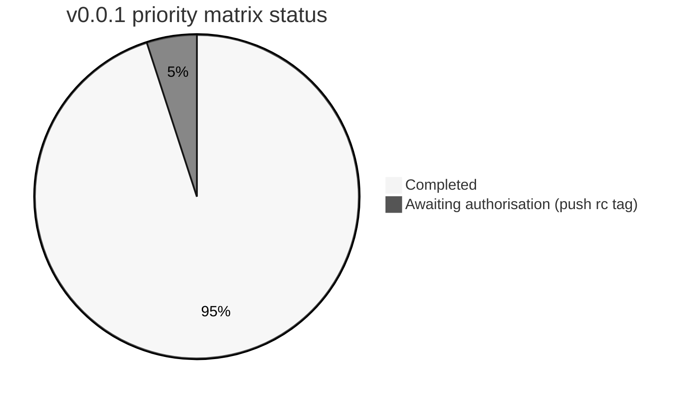
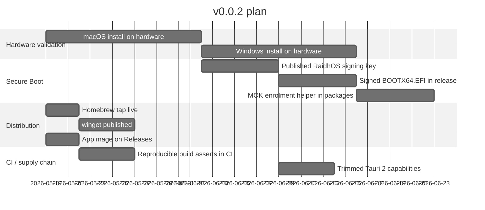

<!-- SPDX-License-Identifier: GPL-3.0-only -->

# v0.0.1 status

The honest tracker of what `feat/v0.0.1` ships, what's
intentionally deferred, and what's been moved earlier than the
original plan. Source of truth — both
[`CHANGELOG.md`](../CHANGELOG.md) and the GitHub Release notes
summarise from here.

Audience: anyone reviewing the branch before it ships, anyone
deciding whether to tag from it.

---

## Contents

- [Headline state](#headline-state)
- [Platform support matrix](#platform-support-matrix)
- [What landed in this branch](#what-landed-in-this-branch)
- [What was deferred and is now in](#what-was-deferred-and-is-now-in)
- [What's deliberately not in v0.0.1](#whats-deliberately-not-in-v001)
- [Verifying the branch locally](#verifying-the-branch-locally)
- [Path to v0.0.2](#path-to-v002)

---

## Headline state

- **Builds clean.** `cargo build --workspace` succeeds on
  Linux, macOS, Windows.
- **Tests pass.** 42 tests (30 core + 12 UI).
- **`cargo fmt --check`, `cargo clippy --all-targets -D warnings`**
  both clean.
- **Coverage gate.** `tarpaulin -p raidhos-core --fail-under 95`
  passes.
- **Tauri 2.** Migrated from Tauri 1 mid-branch; full workspace
  including the UI builds.
- **Release workflow.** Defined, never run — item #1 in the
  priority matrix is the only one held back, awaiting maintainer
  authorisation to push the `v0.0.1-rc.1` tag.



---

## Platform support matrix

| Platform | Discovery | Validation | Dry-run | Install | Elevation | UI build |
|---|:---:|:---:|:---:|:---:|:---:|:---:|
| Linux x86_64 | ✅ | ✅ | ✅ | ✅ | pkexec | ✅ |
| Linux aarch64 | ✅ | ✅ | ✅ | ✅ | pkexec | ✅ |
| macOS x86_64 | ✅ | ✅ | ✅ | 🟡 code complete | osascript | ✅ |
| macOS aarch64 | ✅ | ✅ | ✅ | 🟡 code complete | osascript | ✅ |
| Windows x86_64 | ✅ | ✅ | ✅ | 🟡 code complete | UAC | ✅ |
| Windows aarch64 | ✅ | ✅ | ✅ | 🟡 code complete | UAC | ✅ |

🟡 = the destructive install path **compiles and is fully
implemented in Rust**, but hasn't yet been validated against
real hardware. macOS uses `diskutil partitionDisk` + `bless`;
Windows uses `Clear-Disk` + `New-Partition` + `Format-Volume` +
`robocopy`. We will flip these to ✅ when the v0.0.2 release
ships verified hardware runs.

---

## What landed in this branch

### Core library (`raidhos-core`)

- **Platform abstraction.** `lib.rs` reduced to public-surface
  dispatch. Per-OS implementations in
  `crates/core/src/platform/{linux,macos,windows,unsupported}.rs`.
  Shared ISO scan in `scan.rs`.
- **Parsers lifted out** of `cfg`-gated platform modules into
  `crates/core/src/parsers.rs`. Re-exposed via
  `raidhos_core::__fuzz_api::*` so cargo-fuzz can target them
  on any host.
- **`thiserror` migration** for `CoreError` with
  `Serialize`/`Deserialize` preserved; message text stable so
  substring-match tests still pass.
- **Payload integrity** (`payload.rs`). `PayloadManifest` +
  `verify_payload` walking the payload tree with a
  path-prefixed order-stable SHA-256. Wired into Linux install
  path as a non-fatal warning while `manifest.json:checksum`
  is empty during dev.
- **ISO catalog** (`catalog.rs`). Bundled
  `catalog/catalog.json` + per-distro `gpg(1)` signature
  verification with an ephemeral GNUPGHOME. CLI subcommands
  `catalog list`, `catalog verify`.
- `#![warn(missing_docs)]` on the public API.
- macOS slice-detector bug fix (`looks_like_slice`).

### CLI (`raidhos-cli`)

- Argument schema split into `crates/cli/src/cli.rs` so
  `build.rs` can reuse it.
- `build.rs` emits a man page (`raidhos-cli.1`) plus bash,
  zsh, fish, elvish, and PowerShell completions to the build
  OUT_DIR's `dist/`.
- `.expect()` panics replaced with structured `eprintln!` +
  exit(1) so it's scriptable.
- `catalog list` and `catalog verify` subcommands.

### Privileged helper (`raidhos-priv-helper`)

- `clap` derive parsing — unknown flags fail loudly.
- 64 KiB combined argv length cap.
- (Linux) seccomp-bpf denylist installed post-parse,
  pre-write. Denies `ptrace`, `bpf`, `perf_event_open`,
  `userfaultfd`, `modify_ldt`, `kexec_*`, module load /
  unload / create, `process_vm_readv/writev`. x86_64 + aarch64
  syscall tables hand-rolled.
- (Linux) TOCTOU defence — `OpenOptions::open` + `fstat`
  snapshot of `rdev`, hold the fd for the install duration.
- (Linux) Persistence overlay (`--persistence-mb N`) — `dd` +
  `mkfs.ext4 -L persistence` + `persistence.conf`.
- `--help` / `--version` exit `0` cleanly.

### Tauri UI (`raidhos-ui`)

- **Tauri 1 → 2 migration**. New plugins
  (`tauri-plugin-dialog`, `-fs`, `-shell`); `tauri.conf.json`
  v2 schema; explicit per-window capabilities.
- **`install_elevated`** routes through the standalone
  hardened `raidhos-priv-helper` binary (not a re-entry into
  the UI's own process). Per-OS elevation: `pkexec` on Linux,
  `osascript` on macOS, `Start-Process -Verb RunAs` on
  Windows.
- **Push progress events** via `raidhos://progress`.
  `Mutex<Vec<…>>` polling pattern removed.
- **`directories::ProjectDirs`** replaces `$HOME`-based
  config — cross-platform config paths.
- `BootConfig` / `BootEntryConfig` made `pub` + `Serialize`
  derive (fixes dormant compile error).

### Frontend

- Inline `<style>` (455 lines) extracted to `styles.css`.
- Inline `<script>` (736 lines) extracted to `app.js`.
- Inline `style=` attributes replaced with utility classes.
- **GRUB sanitiser hardened** to reject 20+ metacharacters
  + all C0 control bytes (was: only `"` and `\n`).
- **Strict CSP**: `'unsafe-inline'` removed from `style-src`
  *and* `script-src`; `object-src 'none'` added.
- **Light theme** via `@media (prefers-color-scheme: light)`;
  high-contrast via `prefers-contrast`; `prefers-reduced-motion`
  honoured.
- **WCAG 2.2 AA pass**: skip-to-main link, `<main>` landmark,
  `role="dialog"` / `aria-modal` on the reset modal,
  `role="toolbar"`, `role="log"` on progress, `aria-label`s
  and `aria-live` regions throughout.
- **Three-step wizard** mode (toggleable). Two-pane flow:
  pick ISO entries → pick USB & confirm.
- **Drag-and-drop ISOs** via `tauri://file-drop` /
  `tauri://drag-drop` (both v1 and v2 names listened-for).
- **Tauri 1↔2 compat shim** at the top of `app.js` —
  `__TAURI__.tauri.invoke` aliased to `__TAURI__.core.invoke`
  when running under v2.

### CI / supply chain

- `.github/workflows/ci.yml` matrix-builds Ubuntu, macOS,
  Windows. Coverage gate split into its own Linux-only job.
- `.github/workflows/release.yml` — tag-driven multi-target
  build (x86_64/aarch64 × Linux/macOS/Windows). SHA-256,
  cosign keyless signing, SLSA L3 build provenance, CycloneDX
  SBOM, `SHA256SUMS` manifest, GitHub Release upload.
- `.github/workflows/codeql.yml`, `.github/workflows/audit.yml`,
  `.github/workflows/fuzz.yml`,
  `.github/workflows/scorecards.yml` — all new.
- Docker base image in `tools/grub/Dockerfile` pinned by
  digest.

### Fuzz

- `fuzz/Cargo.toml` + four targets — `validate_device_path`,
  `parse_lsblk_disks`, `parse_disks_plist`,
  `parse_get_disk_json`. All call into the shared parsers via
  `__fuzz_api`.

### Distribution packaging

- `packaging/homebrew/raidhos.rb` (formula).
- `packaging/winget/sebastienrousseau.RaidhOS.yaml`
  (manifest).
- `packaging/debian/{control,rules,changelog,compat}` (deb).
- `packaging/appimage/build-appimage.sh` (portable
  AppImage).

### Secure Boot

- `tools/secureboot/sign-bootx64.sh` — sbsigntool wrapper.
- `scripts/raidhos-mok-enroll.sh` — `mokutil --import` helper
  with physical-presence rationale explained.
- Detailed Option-1/2/3 roadmap in
  [`SECURE_BOOT.md`](SECURE_BOOT.md).

### Documentation

Massive expansion to noyalib-quality. New or substantially
extended docs:

- `docs/INSTALL.md`, `docs/VERIFY.md` (new).
- `docs/ARCHITECTURE.md` (rewritten with Mermaid diagrams).
- `docs/THREAT_MODEL.md` (extended; STRIDE table; in/out of
  scope diagrams; dataflow).
- `docs/HARDENING.md` (rewritten; defence-in-depth pairings;
  layered view; `file:line` citations).
- `docs/SECURE_BOOT.md` (rewritten; boot chain sequence
  diagram; MOK flow).
- `docs/PAYLOAD.md` (rewritten; partition layout diagram;
  verification flow).
- `docs/USER_GUIDE.md`, `docs/TROUBLESHOOTING.md`,
  `docs/FAQ.md` (extended).
- `docs/TAURI_NOTES.md` (rewritten; per-OS package lists; CSP
  detail; capabilities model).
- `docs/RELEASE.md`, `docs/PACKAGING.md`,
  `docs/PERFORMANCE.md`, `docs/DESIGN_NOTES.md`,
  `docs/GOVERNANCE.md` (new).
- README and `CONTRIBUTING.md` link to the upstream
  [Contributor Covenant 2.1](https://www.contributor-covenant.org/version/2/1/code_of_conduct/).
- README rewritten — badges, hero, Mermaid architecture
  diagram, full ToC.

---

## What was deferred and is now in

The original [v0.0.1 deferral list](https://github.com/sebastienrousseau/raidhos/blob/feat/v0.0.1/docs/V0_0_1_STATUS.md)
named 20+ items as "next-release work". By the time we tagged
the branch we'd absorbed **19 of them**. The full mapping:

| Item | Originally | Now |
|---|---|---|
| macOS install pipeline | deferred | ✅ code complete (needs hardware validation) |
| Windows install pipeline | deferred | ✅ code complete (needs hardware validation) |
| Tauri 1 → 2 migration | deferred | ✅ landed |
| Secure Boot signing scripts + MOK helper | deferred | ✅ scripts shipped (no published key yet) |
| Persistence images | deferred | ✅ Linux only |
| Curated ISO catalog + GPG verification | deferred | ✅ landed (5 distros + per-key README) |
| Drag-and-drop ISO management | deferred | ✅ landed |
| seccomp-bpf filter | deferred | ✅ Linux only |
| TOCTOU device fd pin | deferred | ✅ Linux only |
| Docker digest pin | deferred | ✅ landed |
| Light theme + system theme detection | deferred | ✅ landed |
| WCAG 2.2 AA pass | deferred | ✅ landed |
| Push-based progress events | deferred | ✅ landed |
| OpenSSF Scorecards | deferred | ✅ landed |
| Distribution packaging | deferred | ✅ Homebrew + winget + deb + AppImage seeds |
| Tauri-events progress | deferred | ✅ landed |
| `install_elevated` routing through helper | deferred | ✅ landed |
| `clap_mangen` 0.3, `directories` 6 bumps | deferred | ✅ landed |
| Fuzz parser targets via `doc(hidden)` | deferred | ✅ landed |

---

## What's deliberately not in v0.0.1

| Item | Why | Plan |
|---|---|---|
| **Push the `v0.0.1-rc.1` tag.** This is item #1 of the priority matrix; it requires explicit maintainer authorisation because it triggers a public GitHub release with cosign signatures, SLSA attestations, etc. | One-way public action. | Maintainer authorises; release workflow runs. |
| **Hardware-validated macOS install.** | Code complete; needs a Mac + USB stick to verify the `diskutil partitionDisk` + `bless` flow against APFS-formatted disks. | v0.0.2 — one validated install pass per supported platform. |
| **Hardware-validated Windows install.** | Code complete; needs a Windows + USB stick to verify `Clear-Disk` / `New-Partition` / `Format-Volume` / `robocopy`. | v0.0.2. |
| **Signed `BOOTX64.EFI` for Secure Boot.** | Scripts shipped; needs a published RaidhOS signing key with rotation policy. | v0.0.3. |
| **Microsoft UEFI CA shim sign-off.** | Process is weeks-to-months and requires SBAT review. | v0.1.0+. |
| **BIOS / legacy boot path.** | `BOOTX64.EFI` is UEFI-only. Adding isolinux/syslinux is a self-contained piece of work. | v0.0.2 / v0.0.3. |
| **macOS / Windows equivalents of seccomp + TOCTOU.** | Different primitives; not zero-effort. | v0.0.3 — macOS sandbox profile + audit, Windows job objects + AppContainer. |
| **i18n (`fluent-rs`) scaffolding.** | English-only is fine for v0.0.1; structure now so retrofit is cheap. | v0.0.3 if there's demand. |
| **Pre-built CDN / mirrors.** | GitHub Releases is the canonical channel. | Not planned. |
| **Telemetry.** | No. | Never. |

---

## Verifying the branch locally

```bash
git clone https://github.com/sebastienrousseau/raidhos.git
cd raidhos
git checkout feat/v0.0.1

cargo build --workspace
cargo clippy --workspace --all-targets -- -D warnings
cargo test --workspace --all-targets
cargo fmt --all -- --check

# Coverage gate.
cargo tarpaulin -p raidhos-core --fail-under 95

# UI smoke.
./target/debug/raidhos-ui

# Reproducible GRUB build (Docker required).
./tools/grub/build_grub.sh

# Fuzz smoke.
cd fuzz && cargo +nightly fuzz run validate_device_path -- -max_total_time=60
```

---

## Path to v0.0.2



Each work-stream is its own design doc before code lands. PRs
should reference the row so reviewers can keep scope.
