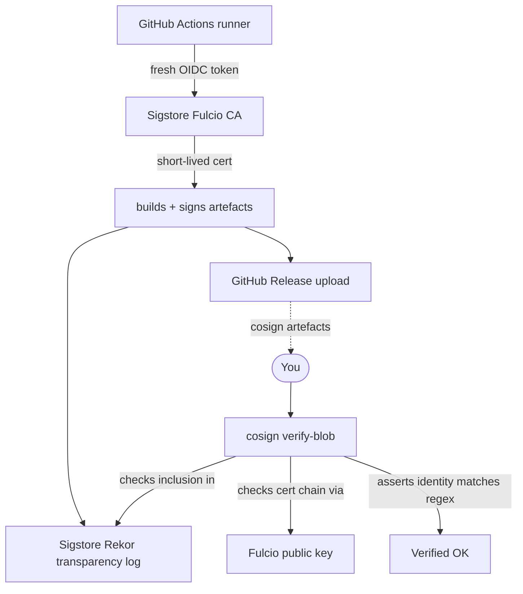

<!-- SPDX-License-Identifier: GPL-3.0-only -->

# Verifying a release

Every RaidhOS release publishes four files per binary archive:

| File | What it is |
|---|---|
| `raidhos-vX.Y.Z-<target>.tar.gz` (or `.zip` on Windows) | The artefact itself. |
| `…sha256` | SHA-256 of the artefact. |
| `…sig` | [cosign](https://github.com/sigstore/cosign) keyless signature over the artefact. |
| `…pem` | The OIDC-bound short-lived certificate cosign produced. |

Plus, **per release**:

- `SHA256SUMS` — one line per file. Pair with `sha256sum -c` to
  check everything at once.
- A SLSA L3 build-provenance attestation, queryable via
  `gh attestation verify`.
- A CycloneDX SBOM (`raidhos.cdx.json`) — useful for downstream
  audit and dependency review.

This document walks through verifying any of them.

---

## Contents

- [Why verify?](#why-verify)
- [What you need](#what-you-need)
- [Recipe — Linux / macOS](#recipe--linux--macos)
- [Recipe — Windows](#recipe--windows)
- [Verifying the SBOM](#verifying-the-sbom)
- [Verifying SLSA provenance](#verifying-slsa-provenance)
- [Verifying the bundled `BOOTX64.EFI`](#verifying-the-bundled-bootx64efi)
- [Trust model](#trust-model)
- [Threat: a malicious release](#threat-a-malicious-release)

---

## Why verify?

You're about to hand a binary the keys to your USB stick. The
threat model
([`THREAT_MODEL.md`](THREAT_MODEL.md)) names "adversary on the
network between user and GitHub" and "compromised supply chain"
as in-scope attackers. Verification is the user-side defence.

Verification is also strictly opt-in — your distro's package
manager has already done this for you if you installed via
APT / Homebrew / winget. The recipe below is for the case where
you download a tarball directly.

---

## What you need

| Tool | Purpose | Linux / macOS install | Windows install |
|---|---|---|---|
| `sha256sum` (Linux) / `shasum` (macOS) / `Get-FileHash` (Windows) | Hash verification | preinstalled | preinstalled |
| [`cosign`](https://docs.sigstore.dev/cosign/system_config/installation/) | cosign signature verification | `brew install cosign` (mac), package manager (Linux) | `winget install sigstore.cosign` |
| [`gh`](https://cli.github.com/) | SLSA provenance verification | package manager | `winget install --id GitHub.cli` |

---

## Recipe — Linux / macOS

```bash
VERSION=0.0.1
TARGET=x86_64-unknown-linux-gnu        # or aarch64-unknown-linux-gnu, x86_64-apple-darwin, aarch64-apple-darwin
ARCHIVE="raidhos-v${VERSION}-${TARGET}.tar.gz"

cd "$(mktemp -d)"
for f in "$ARCHIVE" "${ARCHIVE}.sha256" "${ARCHIVE}.sig" "${ARCHIVE}.pem"; do
    gh release download "v${VERSION}" \
        --repo sebastienrousseau/raidhos \
        --pattern "$f"
done

# 1. SHA-256.
if command -v sha256sum >/dev/null; then
    sha256sum -c "${ARCHIVE}.sha256"
else
    # macOS doesn't ship sha256sum, but shasum -a 256 -c works.
    shasum -a 256 -c "${ARCHIVE}.sha256"
fi

# 2. cosign keyless signature. The certificate identity *must*
#    match the project's GitHub Actions OIDC subject. We use a
#    regex so that release branches and tag refs both match.
cosign verify-blob \
    --certificate         "${ARCHIVE}.pem" \
    --signature           "${ARCHIVE}.sig" \
    --certificate-identity-regexp "https://github.com/sebastienrousseau/raidhos/.+" \
    --certificate-oidc-issuer     "https://token.actions.githubusercontent.com" \
    "$ARCHIVE"

# 3. SLSA provenance.
gh attestation verify "$ARCHIVE" --owner sebastienrousseau

# 4. If all three pass, extract.
tar -xzf "$ARCHIVE"
```

Expected output for step 2 is **`Verified OK`**. Anything else
(certificate identity mismatch, signature mismatch, OIDC issuer
wrong) means **do not run the binary**.

---

## Recipe — Windows

```powershell
$Version = '0.0.1'
$Target  = 'x86_64-pc-windows-msvc'    # or aarch64-pc-windows-msvc
$Archive = "raidhos-v$Version-$Target.zip"

# 1. Download.
foreach ($Suffix in '', '.sha256', '.sig', '.pem') {
    gh release download "v$Version" `
        --repo sebastienrousseau/raidhos `
        --pattern "$Archive$Suffix"
}

# 2. SHA-256.
$Expected = (Get-Content "$Archive.sha256").Split(' ')[0].ToLower()
$Actual   = (Get-FileHash -Algorithm SHA256 $Archive).Hash.ToLower()
if ($Expected -ne $Actual) {
    Write-Error 'sha256 mismatch'
    exit 1
}

# 3. cosign.
cosign verify-blob `
    --certificate         "$Archive.pem" `
    --signature           "$Archive.sig" `
    --certificate-identity-regexp 'https://github.com/sebastienrousseau/raidhos/.+' `
    --certificate-oidc-issuer     'https://token.actions.githubusercontent.com' `
    $Archive

# 4. SLSA.
gh attestation verify $Archive --owner sebastienrousseau

# 5. If all three pass, extract.
Expand-Archive $Archive -DestinationPath .
```

---

## Verifying the SBOM

The CycloneDX SBOM lists every Rust crate, version, and
licence that goes into the binary. Useful for security review
and dependency-allowlist enforcement.

```bash
gh release download "v${VERSION}" \
    --repo sebastienrousseau/raidhos \
    --pattern "raidhos.cdx.json"

# cdx-cli (https://github.com/CycloneDX/cdx-cli) can also do this.
jq -r '.components[] | "\(.name)@\(.version) – \(.licenses[0].license.id // "?")"' \
   raidhos.cdx.json | sort -u
```

A non-trivial SBOM with `serde`, `serde_json`, `sha2`,
`thiserror`, `clap`, `directories` (UI), and `tauri` (UI) is
the expected shape. If the SBOM lists crates you don't
recognise, treat that as a flag to investigate before running.

---

## Verifying SLSA provenance

The SLSA L3 attestation answers "was this binary built by the
project's own GitHub Actions workflow, in a specific commit, on
a clean runner?"

```bash
gh attestation verify "$ARCHIVE" --owner sebastienrousseau

# Inspect the predicate yourself if you want to see the
# triggering workflow + commit hash:
gh attestation list --owner sebastienrousseau --predicate-type \
    https://slsa.dev/provenance/v1
```

A passing attestation tells you:

- the artefact was produced by a workflow file in
  `sebastienrousseau/raidhos`,
- on a hosted runner (no developer machine in the build path),
- from a specific commit SHA,
- with a specific input set.

Spoofing this requires either compromising the GitHub Actions
OIDC issuer or compromising the project's workflow file —
neither is a quiet attack.

---

## Verifying the bundled `BOOTX64.EFI`

The reproducible GRUB build emits its own signed artefact:

```bash
gh release download "v${VERSION}" \
    --repo sebastienrousseau/raidhos \
    --pattern "BOOTX64.EFI*"

sha256sum -c BOOTX64.EFI.sha256

cosign verify-blob \
    --certificate         BOOTX64.EFI.pem \
    --signature           BOOTX64.EFI.sig \
    --certificate-identity-regexp "https://github.com/sebastienrousseau/raidhos/.+" \
    --certificate-oidc-issuer     "https://token.actions.githubusercontent.com" \
    BOOTX64.EFI

gh attestation verify BOOTX64.EFI --owner sebastienrousseau
```

This is the binary the firmware will execute on the first boot
of the USB stick. Verifying it is **strongly** recommended.

Note this is **separate** from Secure Boot signing — see
[`SECURE_BOOT.md`](SECURE_BOOT.md) for the firmware-trust path.

---

## Trust model



You trust four things, in this order:

1. The Sigstore root of trust (Fulcio + Rekor) — published,
   audited, transparency-logged.
2. The fact that the GitHub Actions OIDC issuer is faithful.
3. The certificate-identity regex matching the project's
   workflow URL (you're verifying *this* project, not any
   project).
4. The SHA-256 of the artefact matching the recorded one.

You **don't** have to trust a project-controlled signing key.
Keyless signing means the private key lives only inside an
ephemeral GitHub runner; it never exists on a developer
machine.

---

## Threat: a malicious release

Suppose an attacker uploads a hostile `raidhos-vX.Y.Z-...tar.gz`
to a fake GitHub Release.

| Defence | What it catches |
|---|---|
| `SHA256SUMS` mismatch | If the attacker doesn't update the SHA-256. |
| cosign signature missing or rejected | The attacker doesn't control the project's OIDC identity, so they can't produce a valid keyless signature with the right subject. |
| Certificate-identity regex mismatch | A signature with a different subject (someone else's workflow) fails the regex match. |
| Rekor inclusion missing | A signature not logged in the public transparency log fails. |
| SLSA attestation missing | The artefact wasn't built in the project's CI. |
| Mirror substitution | All the above checks happen against artefacts downloaded directly from the project's release page; mirrors are not in the trust path. |

Practically: an attacker would need to compromise both the
GitHub project (to push the release) **and** the Sigstore
infrastructure (to produce signatures with a matching
identity). The combined effort is high; the detection is
public — Rekor is a transparency log.

The remaining unaddressed risks are documented in
[`THREAT_MODEL.md`](THREAT_MODEL.md) — primarily attackers who
already have root on the user's machine, hardware-level
attackers, and firmware-level attackers, all of which are out
of scope for a userspace USB imager.
